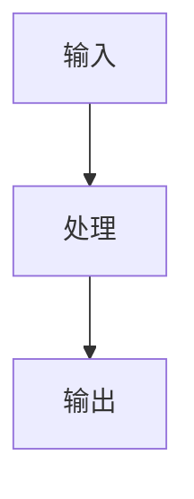

# AGENTS.md

本仓库是《Codex 设计原理》一书的写作空间。站点使用 Docusaurus，结构参考 `luochang212/DL-Demos` 的 `website/` 子项目。

在线阅读：https://luochang212.github.io/codex-notebook/

全书以 `openai/codex` 代码库的**设计决策**为骨架，源码为佐证。除非用户明确要求扩展到其他项目或产品文档，否则所有架构判断都必须回到该代码库验证。

完整大纲见 [outline.md](outline.md)。

## 项目结构

- `website/`：Docusaurus 站点源码。
- `website/docs/intro.mdx`：序章。
- `website/docs/ch{NN}-{slug}.mdx`：正文章节（ch01-ch15）。
- `website/src/css/custom.css`：站点全局样式。
- `website/sidebars.js`：侧边栏配置，按篇章（category）组织，是导航的唯一手写来源。
- `website/docusaurus.config.js`：Docusaurus 配置。
- `skills/`：写作辅助 skill。
- `archived/`：历史审查报告，不参与构建。
- `outline.md`：全书大纲。

## 开发命令

在 `website/` 目录下运行：

```bash
npm install
npm run start
npm run build
```

修改站点结构、MDX、组件或样式后，至少运行：

```bash
cd website
npm run build
```

构建通过才算完成。`node --localstorage-file` 相关 experimental warning 可以忽略，只要 Docusaurus build 成功即可。

## 本地环境

本仓库允许使用 `.env` 保存本地私有配置。

- `.env`：本地私有文件，不提交。
- `.env.example`：提交到仓库，只保留字段结构。

`.env` 应至少包含：

```bash
CODEX_SOURCE_DIR=
```

`CODEX_SOURCE_DIR` 指向本机可用的 `openai/codex` 源码仓库。涉及 Codex 源码判断时，优先从这个路径核对源码；不要把该本机绝对路径写进文档正文或提交内容。

提交身份不要放在 `.env` 中。需要避免 Git 自动使用带本机 hostname 的邮箱时，应设置本仓库的 local git config，例如 `git config user.name ...` 和 `git config user.email ...`。提交后必须检查 commit metadata。

不要把本机用户名、hostname、本机绝对路径、私人邮箱写进提交元数据或文档正文。

# 内容定位

这本书不是源码导读，而是**设计取舍的解剖**。

每一章回答一个设计问题，源码只在"为什么这样做"时出场。读者读完应该能回答：
- Codex 做了哪些关键设计决策？
- 每个决策放弃了什么、得到了什么？
- 如果我要做类似系统，哪些可以直接借鉴，哪些需要根据场景变通？

全书主线：**如何在沙箱安全约束下，让 LLM 拥有尽可能大的代码修改自主权？**

# 章节规范

每个章节放在：

```text
website/docs/ch{NN}-{slug}.mdx
```

并在 `website/sidebars.js` 中加入对应条目。侧边栏按篇章（category）组织，共七篇。

新增或删除章节时，只维护 `website/sidebars.js`；不要维护手写章节清单。

### 章节结构（必须遵循）

每章的骨架：

1. **设计问题**（一句话）— 不是"这个模块有什么"，而是"为什么要这样设计"
2. **直觉答案 vs 实际选择** — 先说读者可能怎么想，再说 Codex 实际怎么做的
3. **取舍** — 得到什么、放弃什么，必须具体到机制
4. **源码佐证** — 只证明设计核心，不贴完整实现
5. **对读者的启示** — 如果要做类似系统，能借鉴什么

### 硬性约束

- 每章 3000-6000 字，不超过 8000 字
- 代码块不超过 40 行，只展示设计核心
- 每章底部一行源码快照（commit hash）
- 图示使用 Mermaid，纵向布局优先

涉及 Codex 源码判断的章节，必须在文章最底部用一行轻量"源码快照"记录核对对象和 `openai/codex` 的完整 commit hash。

## 标题规则

标题必须是自然、通顺、有信息量的中文问题或判断句。不要写生硬翻译腔。

不好的例子：

```text
Codex 的架构选择到底在换什么？
```

更好的例子：

```text
Codex 为什么要付出这些架构复杂度？
```

Docusaurus 的 frontmatter `title` 会自动渲染页面顶部标题。不要在 MDX 正文或组件里重复渲染同一个 H1。

## 源码引用原则

先讲清问题和完整链路，代码只证明承重逻辑。关键分支、状态迁移、生命周期边界或安全回退若无法由文字直接验证，必须引用最小源码；样板、转发和字段搬运不引用。代码前讲清证明目标和阅读重点，代码后解释影响结论的控制流或状态变化；篇幅以读懂为准，不设固定句数，但不逐行翻译、不喧宾夺主。原始源码不得改写；删节须标明，改写须标为带出处的伪代码。路径只是出处，不能代替证据。实现型章节不得为追求简洁而清空必要源码。

## 判断文案原则

不要为了前端显示硬凑字段。尤其是“核心判断”“为什么重要”这类文案，必须来自实际问题和源码事实。

如果某个字段在当前问题下没有实质内容，就改字段名、删掉该展示块，或者把内容合并到正文。不要为了卡片对称写空泛话。

避免这类流于形式的表达：

```text
这决定了系统的稳定性、可扩展性和可维护性。
```

应该写成更具体的判断：

```text
这里真正的风险不是模型能否看到更多上下文，而是 baseline 丢失后是否会错误地继续做 diff，导致模型拿到不完整运行时状态。
```

## 前端与交互原则

交互和设计必须服务理解，不要为了炫技增加信息噪声。

- 章节以纯 MDX 为主，直接使用 Markdown + Mermaid。
- 不要为了布局对称把内容切成无意义的两栏。
- 如果某个章节确实需要交互组件，可以写 React 组件，但不能遮蔽核心内容。

### Mermaid 使用原则

本项目已启用 Docusaurus Mermaid。展示流程、状态迁移、窗口接力、上下文生命周期时，优先考虑 Mermaid。

流程图默认使用纵向布局：

````md

````

只有在节点很少且横向比较不会压缩阅读宽度时，才使用 `flowchart LR`。长流程、带条件分支的流程、移动端需要阅读的流程应使用 `flowchart TD`。

## 语言风格

使用中文。要求：

- 直接、准确、具体。
- 允许指出用户问题中的错误认知，但要说明为什么。
- 优先解释取舍，而不是堆工程名词。
- 不要写宣传腔。
- 不要把“复杂度”“可扩展性”“稳定性”当万能词，必须落到具体机制。

## 工作流约定

修改内容时：

1. 先确认用户最新反馈，避免继续沿用旧方向。
2. 如果修改已有章节，先阅读该章节当前内容。
3. 如果涉及 Codex 源码判断，应优先从 `.env` 的 `CODEX_SOURCE_DIR` 指向的源码仓库核对源码，不要凭记忆写；不要把本机绝对路径写进文档。
4. 新增、删除或重命名章节时，只同步维护 `website/sidebars.js`；不要维护手写章节清单。
5. 使用 `apply_patch` 修改文件。
6. 修改后运行 `cd website && npm run build`。
7. 最终回复说明改了哪些文件，以及构建是否通过。

## 必须真实查看代码仓库

每次回答问题，都必须真实查看 `openai/codex` 代码仓库，不得凭记忆或推测作答。

- 回答前先打开 `CODEX_SOURCE_DIR` 指向的源码，定位到与问题相关的具体文件、函数或类型，再下结论。
- 引用的路径、函数名、字段名、行为描述必须以实际读到的源码为准。如果记不清，宁可现场查源码也不要猜。
- 仅在问题与 Codex 源码无关（例如纯站点构建、Docusaurus 配置、前端组件）时，才可以不查源码；一旦判断落到架构、机制、源码行为层面，就必须查。
- 如果当前无法访问源码仓库，要明确说明无法验证，而不是编造源码细节。

## 不要做的事

- 不要为了组件布局硬凑“核心判断 / 为什么重要”。
- 不要引用信息量低的源码。
