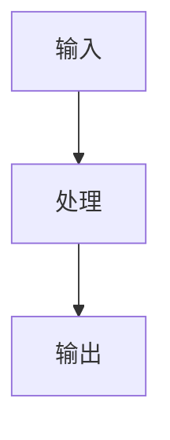

# Codex Notebook

> 我提问，你研究本地的 codex 仓库代码，然后把回答变成 ebook 中的一章

Codex Notebook 是一个使用 Docusaurus 搭建的 Codex 架构问答笔记站点，框架结构参考 `luochang212/DL-Demos`：

- 研究对象：`openai/codex`
- 在线地址：`https://luochang212.github.io/codex-notebook/`
- 站点源码位于 `website/`
- 文档入口位于 `website/docs/intro.mdx`
- 问答索引由 `website/sidebars.js` 的 category `generated-index` 自动生成，访问路径为 `/qa`
- 每个问答章节位于 `website/docs/qa/`
- 侧边栏配置位于 `website/sidebars.js`
- 站点配置位于 `website/docusaurus.config.js`

## 本地运行

```bash
cd website
npm install
npm run start
```

## 构建

```bash
cd website
npm run build
```

## Mermaid 图表

站点已启用 Docusaurus Mermaid 支持。需要展示流程、状态机或模块关系时，可以直接在 MDX 中写：

````md

````

## 在线发布

本仓库使用 GitHub Actions 发布 Docusaurus 站点。推送到 `main` 后，`.github/workflows/deploy.yml` 会执行：

```bash
cd website
npm ci
npm run build
```

构建产物 `website/build` 会作为 GitHub Pages artifact 发布到线上地址。

## 记录格式

每个问答章节通常包含：

- 原始问题
- 研究主题或核心判断
- 关键源码切片
- 架构边界和取舍

章节不维护额外的手写索引清单；问答索引由 `website/sidebars.js` 的 `generated-index` 自动生成。
