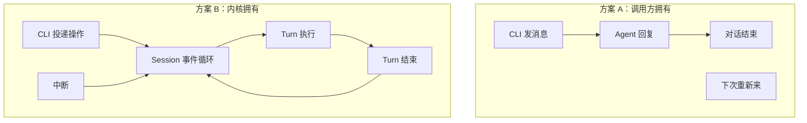
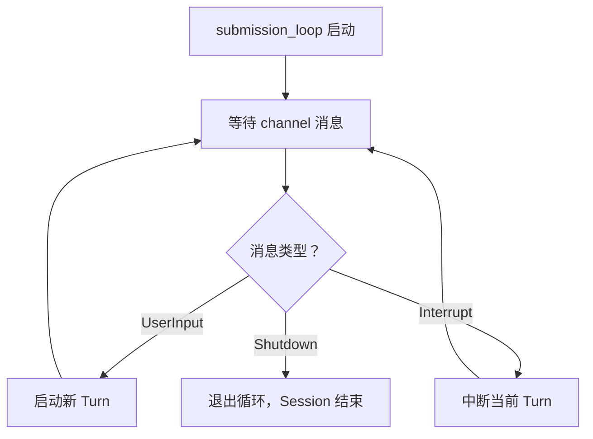
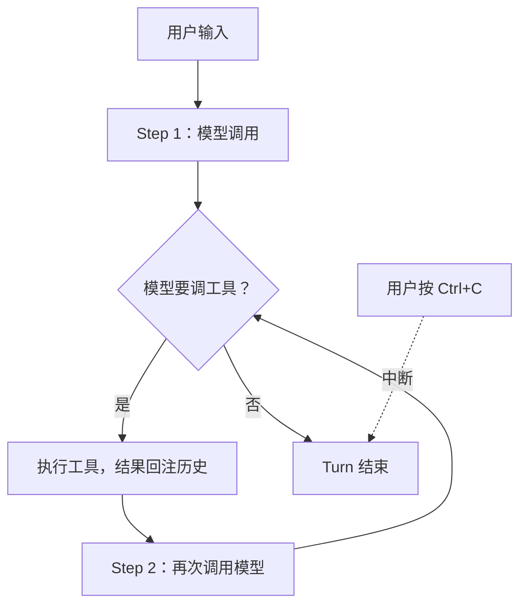

你正在让 Codex 重构一个模块。它已经读了 8 个文件、改了 3 个、跑了 2 次测试。第 4 次测试跑到一半，你发现方向不对，按了 Ctrl+C。

现在问题来了：中断之后，发生了什么？

如果这是一个无状态的 API 调用——你发一条消息，等一条回复——那 Ctrl+C 意味着这次请求作废，之前的 8 次文件读取、3 次修改、2 次测试结果全部蒸发。你得从头来。

但 Codex 不是这样。你按了 Ctrl+C，当前操作停了，但对话还在。模型记得它改过哪些文件、为什么改、测试跑到哪了。你可以直接说"换个方向，别动 auth 模块"，它接着干。

这个"中断不丢状态"的能力，不是一个小功能。它背后是一个根本性的架构决策：**谁拥有对话的生命周期？**

## 调用方拥有，还是内核拥有？

两种选择：

方案 A 简单：请求-响应，无状态，调用方控制一切。ChatGPT 网页版就是这样——你发一条，它回一条，没有"进行中"的概念。

方案 B 复杂：Session 是一个长生命周期的有状态对象，有自己的事件循环。调用方不能"等待回复"，只能往 channel 里投递操作，然后订阅事件流自己判断发生了什么。

Codex 选了 B。为什么？因为 coding agent 和聊天机器人有一个本质区别：**coding agent 的一次"回答"可能包含 20 次工具调用、持续 3 分钟。** 在这 3 分钟里，用户可能想中断、想追加指令、想关掉终端明天继续。这些需求在方案 A 里做不到。

## Session 的心跳：submission_loop

Session 创建时启动一个后台 tokio task，叫 `submission_loop`。它就是 Session 的心跳——只要 Session 活着，这个循环就在跑：

调用方（CLI、IDE 插件、TUI）和 Session 之间只有两根管道：一根投递操作（`tx_sub`），一根接收事件（`rx_event`）。调用方不能"同步等回复"——它只能订阅事件流，看到 `TurnComplete` 事件时知道这轮结束了。

这个设计让 TUI、IDE 插件、子 agent 可以用同一套接口。它们只是订阅事件流的方式不同。

## Turn：一次有界的执行

一个 Turn 从用户输入开始，到模型不再请求工具调用时结束。中间可能经历很多"步"（每步 = 一次模型调用 + 可能的工具执行）：

Turn 的结束条件只有一个：模型输出了纯文本（没有 tool call），或者被中断/出错。没有"最多跑 N 步"的硬限制——模型自己决定什么时候停。

## 为什么必须分开

一个 Session 可以有多个 Turn。它们共享对话历史、配置、审批状态。但每个 Turn 有自己独立的取消令牌和上下文快照。

这意味着：

- 中断一个 Turn 不杀 Session——用户可以继续对话
- 子 agent 就是一个独立的 Session——父 agent 通过 channel 和它通信，不需要特殊机制
- Session 的 rollout 可以序列化到磁盘——关掉终端，明天打开，对话还在

## 代价

Session 是重量级对象。它持有 Mutex、watch channel、Arc 引用计数、input queue。如果你只想做一个"问一句答一句"的轻量 bot，这套东西是过度设计。

另一个代价：调用方失去了对 Turn 边界的直接控制。你不能说"等这条消息的回复"——你只能订阅事件流，自己判断 `TurnComplete` 是否到达。对于习惯了 `await response` 的开发者，这个心智转换不自然。

还有一个隐含约束：`submission_loop` 是串行的。一个 Session 同一时刻只能跑一个 Turn。想并行？spawn 子 agent，每个子 agent 是独立的 Session。

## 回到那个 Ctrl+C

现在你能理解为什么中断不丢状态了：Session 拥有对话历史，Turn 只是 Session 内部的一次有界执行。中断杀的是 Turn，不是 Session。历史在 Session 里，不在 Turn 里。

这个决策的连锁反应很大：它决定了 Codex 的持久化方式（序列化 Session 而非 Turn）、多 agent 通信方式（Session 间 channel 而非函数调用）、以及上下文管理方式（baseline 属于 Session，diff 属于 Turn 内的 step）。

第一个设计决策不是"用什么模型"，而是"谁拥有对话"。后面的所有架构，都是这个选择的推论。

---

源码快照：`openai/codex` @ `841e47b8fb`（`codex-rs/core/src/session/session.rs`、`session/turn.rs`、`session/handlers.rs`）
