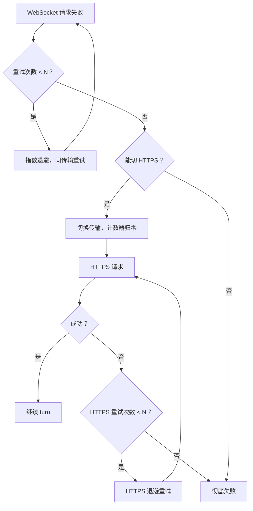
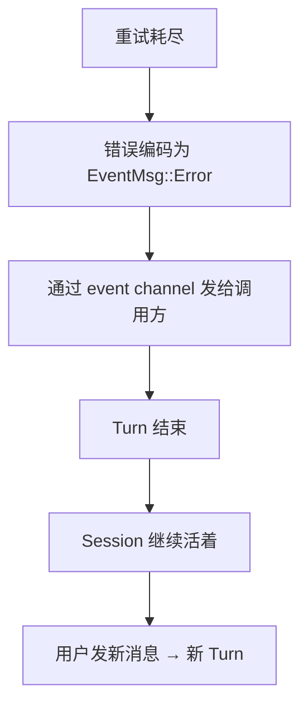

你让 Codex 改一个 bug。它正在读文件、思考、准备输出 patch。突然终端底部闪了一行字：

```
Reconnecting... 1/5
```

两秒后：

```
Reconnecting... 2/5
```

然后它继续干活了。好像什么都没发生。你甚至不确定刚才断的是什么——网络？服务端？WebSocket？

这个"好像什么都没发生"，是三层防线协作的结果。而且这三层解决的是三个不同粒度的问题。

## 第一层：同一条路，再试几次

网络抖了、服务端短暂过载——这类瞬态故障，等一等再试就好了。Codex 用指数退避重试：初始等待 200ms，每次乘以 2，并加一个 0.9–1.1 的随机抖动避免雷群效应。最多 N 次。

用户看到的 "Reconnecting... 2/5" 就是这层在工作。它没有换路，只是在同一条路上等红灯。

## 第二层：换一条路

如果 WebSocket 连续 N 次都失败了，说明这条路可能真的不通（比如公司防火墙掐了 WebSocket 但 HTTPS 还能用）。这时候系统做一件事：**切换到 HTTPS，重置重试计数器，再来一轮。**



这意味着一次 turn 最多可以经历 2×N 次重试。用户可能等了 30 秒，但 turn 没断，对话没丢。

关键设计：降级不是"放弃 WebSocket"，而是"用另一种传输重新获得完整的重试预算"。

## 第三层：彻底失败了，然后呢？

2×N 次都失败了。这次真的不行了。

但系统不会 panic，不会弹一个"请求失败请重试"的对话框。错误被编码成一个事件（`EventMsg::Error`），通过 event channel 发给调用方。Turn 结束，但 Session 不死。对话历史还在，用户可以发一条新消息开启新 turn。



错误不是异常，不是崩溃——它是事件流里的一条普通消息。调用方（TUI、IDE）决定怎么展示。Session 本身不关心。

## 为什么客户端分两层？

你可能注意到 Codex 有两个客户端对象：`ModelClient` 和 `ModelClientSession`。这不是过度设计，而是因为有一个棘手的约束：**sticky routing token**。

服务端给每个 turn 发一个 token，同一个 turn 内的所有请求（包括重试）必须带同一个 token——这样服务端能把请求路由到同一个推理实例。但不同 turn 之间不能复用这个 token。

所以：

- `ModelClient`：活整个 Session，持有认证、provider 配置。不变的东西。
- `ModelClientSession`：每个 Turn 创建一个，缓存 sticky token。Turn 结束就丢弃。
- WebSocket 连接：Session 级复用。Turn 结束时连接被存回 Session 缓存，下一个 Turn 取出来继续用。不是每个 Turn 重新建连。

如果 `ModelClientSession` 跨 turn 复用，上一个 turn 的 token 就会泄漏到下一个 turn，违反客户端/服务端契约。这个 bug 很隐蔽——不会报错，只是路由不对，推理质量可能下降。

## 对上层完全透明

turn 循环的代码不知道底层是 WebSocket 还是 HTTPS。它只看到"流式事件进来了"或者"出错了"。传输选择、重试、降级，全部封装在 `ModelClientSession` 内部。

代价是 `ModelClientSession` 变成了一个有状态对象（缓存连接、缓存 token），不能随意创建和丢弃。但换来的是：turn 循环的代码完全不需要处理传输细节。如果你的 agent 只有一种传输（纯 HTTPS），这层封装可以省掉。但一旦引入 WebSocket（为了流式响应的低延迟），降级路径就是必须的。

---

源码快照：`openai/codex` @ `841e47b8fb`（`codex-rs/core/src/client.rs`、`responses_retry.rs`、`session/turn.rs`）
