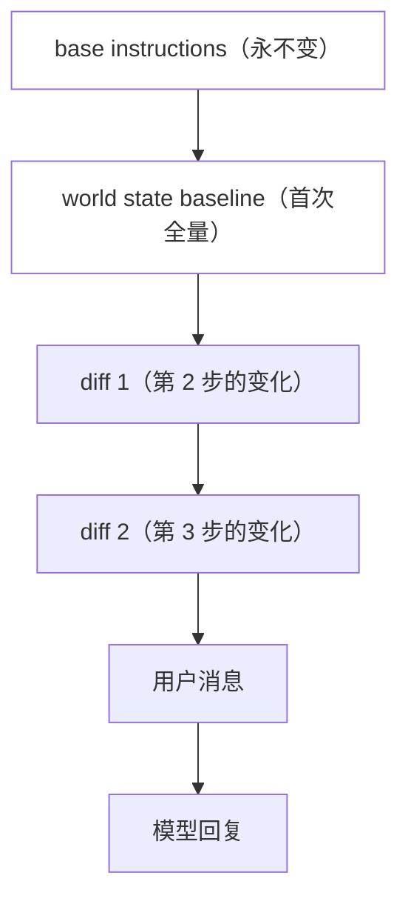
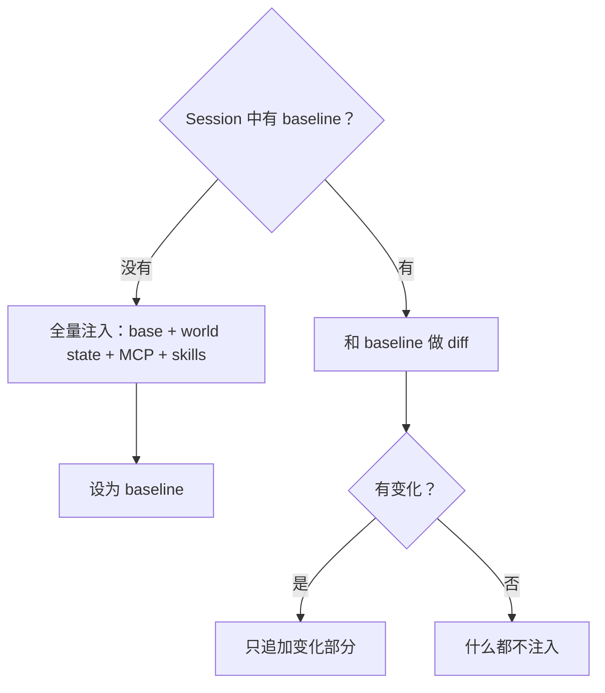

想象你在编一份报纸。每天出刊前，你要决定：头版放什么、哪些新闻是新的、哪些是昨天就有的但今天更新了、哪些广告位要换。

你不会每天把整份报纸从头写一遍。你有一个**底版**——不变的报头、固定的栏目框架。然后你往上贴**增量**：今天的新闻、更新的股价、新来的广告。底版不动，增量追加。

为什么要这样？因为印刷厂有个规矩：**如果底版变了，整条流水线要重新校准。** 校准一次很贵。底版不变，只换增量，流水线就能持续跑。

Codex 的上下文构造就是这个逻辑。模型每次被调用时看到的"system prompt"不是一个固定字符串——它是一条装配流水线的产物。而这条流水线的核心约束是：**前缀不能变，变了就浪费钱。**

## 为什么前缀不能变

OpenAI 和 Anthropic 的 API 都有 prompt cache：如果你这次请求的前缀和上次一样，服务端可以复用已缓存的 KV cache，不用重新计算。前缀稳定时，费用显著降低。

但命中条件是**前缀逐字节相同**。如果你在 system prompt 中间插了一段变化的内容（比如当前工作目录或权限配置），前缀就变了，cache 就 miss。

所以规则很简单：**不变的信息放前面，变化的信息追加在后面。**

前缀（base instructions + baseline）整个 turn 不变。变化只追加在尾部。Cache 持续命中。

## 每步都重新"采访"，但不是每步都"见报"

每个 model step 之前，`capture_step_context` 会重新收集所有环境信息：

- AGENTS.md（可能因为工作目录切换而变化）
- MCP 工具列表（可能因为 server 启动/关闭而变化）
- 环境选择（workspace roots、cwd）
- 能力发现（executor capabilities）

用报纸类比：记者每步都出去采访（重建 WorldState），但只有采访到了**新东西**，才会见报（注入上下文）。如果环境完全没变，这步什么都不追加。

## 没有 baseline 时全量，有 baseline 后增量

Session 的第一个 Turn（或者 rollback 裁掉了包含初始上下文的 developer bundle 时），系统做一次全量注入：base instructions、完整的 world state、MCP 工具列表、可用 skills。这是“底版”。注入完成后，当前快照成为 baseline。

从第二个 Turn 开始，baseline 已经存在于 Session 中。后续每步只做 diff：和 baseline 比较，只注入变化的部分。baseline 跨 Turn 保留，不需要每个 Turn 重新全量。

什么时候 baseline 会重置？Compaction 会在压缩过程中同步安装新的 baseline（不是清空后等下一步重建，而是压缩完成时新 baseline 已经就位）。Rollback 裁掉初始上下文后，`reference_context_item` 被清空，下一步会重新全量注入。正常对话中，baseline 从第一个 Turn 建立后就一直延续。

这不是为了省 token（虽然确实省了）。核心目的是**保护前缀不变**。如果每步都全量重建，前缀就变了，cache 就 miss。只追加 diff，前缀不动，cache 命中。

## 上下文的来源清单

从源码的 `context/` 目录可以看到所有注入来源：

| 来源 | 注入时机 | 变化频率 |
|------|----------|----------|
| 基础指令 | 首次全量 | 整个 session 不变 |
| AGENTS.md | 每步检查 | 偶尔（cd 或文件修改） |
| 权限说明 | 配置变化时 | 很少 |
| 环境信息（cwd、权限、子 agent 列表等） | 每步 | 经常 |
| 可用 skills | 首次或变化时 | 偶尔 |
| MCP 工具 | 每步重建 | 偶尔 |
| 子 agent 列表 | 每步（baseline/diff） | 经常（多 agent 模式） |
| 时间提醒 | 周期性 | 固定间隔 |

注意变化频率的差异：base instructions 整个 session 不变，environment cwd 和子 agent 列表每步都可能变。如果把它们放在同一个“system prompt 模板”里，要么每步都变（cache miss），要么环境信息不更新（模型不知道环境变了）。baseline/diff 机制让不同频率的信息各得其所。

## 代价

这套机制的代价很具体：

**你无法打开一个文件看到"模型看到的完整 system prompt"。** 它不存在于任何一个地方。它是 baseline + 所有 diff 的叠加结果。调试"为什么模型不知道 X？"需要追踪 X 的注入条件和 diff 逻辑。

**实现复杂度。** baseline/diff 比"每次全量拼"复杂得多。需要维护 baseline、做 diff、处理 baseline 重置（compaction 后，见 ch05）。

**但换来的是：** 一个长 turn 里，前缀稳定不变，服务端 cache 可以持续复用。如果用全量重建，每步前缀都不同，cache 无法命中。对于长 turn（coding agent 的典型场景），这是数量级的 token 费用差距。

## 一句话总结

上下文不是一个字符串，是一条装配线。约束是"前缀不能变"，策略是"首次全量、后续追加 diff"，代价是调试困难，收益是 cache 命中率。

---

源码快照：`openai/codex` @ `841e47b8fb`（`codex-rs/core/src/session/mod.rs`、`session/step_context.rs`、`context/`）
