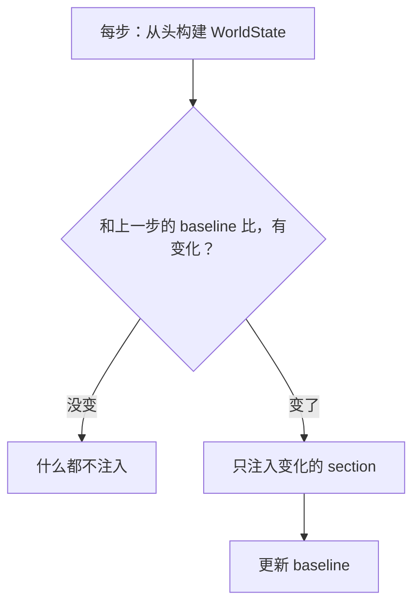

ch04 讲了上下文装配的总流程。这一章只聚焦其中一个子问题：环境信息（git status、子 agent 列表、AGENTS.md、权限配置）每步都可能变，怎么告诉模型？

我用问答的方式推进。

## 每步都全量注入不行吗？

可以，但贵。

假设一个 turn 有 10 个 step（模型调了 10 次工具）。环境信息大约 2000 token。每步全量注入 = 10 × 2000 = 20000 token 花在重复的环境信息上。

更致命的是：每步追加一段全量 WorldState，前缀就变了，prompt cache 就 miss。10 步全 miss。

## 那完全不注入呢？

也不行。模型不知道环境变了。

比如模型在 step 3 执行了 `git checkout -b feature`，到 step 7 它需要知道当前分支已经变了。如果不告诉它，它可能基于错误的分支信息做决策。

## 所以答案是？

**每步都重建，但只注入变化。**

"重建"和"注入"是两件事。重建是为了保证正确性（不遗漏变化），注入是为了效率（只告诉模型新东西）。

如果某步环境完全没变（模型只是输出了一段文本），fragments 为空，不注入任何内容。零开销。

## 具体怎么 diff？

WorldState 是一个 section 集合。每个 section 对应一类环境信息：

- `RealtimeState`：实时状态
- `AgentsMdState`：AGENTS.md 内容
- `PermissionsState`：权限配置
- `EnvironmentsState`：工作目录、子 agent 列表
- `PluginsInstructionsState`：插件指令

每步构建完新的 WorldState 后，和上一步的 snapshot 逐 section 比较。只有内容变了的 section 才会被渲染成文本追加到对话历史。

持久化层也做 diff：首次记录 `WorldStateItem::full`（全量快照），后续记录 `WorldStateItem::patch`（JSON merge patch）。patch 通常比全量小，但每次变化仍会新增 rollout item——文件仍然增长，只是慢。

## baseline 什么时候重置？

两种情况：

1. **Compaction**（ch05）：压缩后旧历史被摘要替代，baseline 必须重置为压缩时刻的完整 WorldState。否则后续 diff 基于一个已经不存在的基准。
2. **Rollback**：如果回滚裁掉了包含初始上下文的 developer bundle，`reference_context_item` 被清空，下一步会重新全量注入并建立新 baseline。

注意：正常 Turn 结束**不会**重置 baseline。baseline 跨 Turn 保留在 Session 中。第二个 Turn 开始时，系统仍然基于已有 baseline 做 diff，而不是重新全量注入。

这里有一个真实的风险：如果 compaction 时 baseline 处理不当（比如丢了某个 section），后续 diff 就会基于错误的基准，模型可能看到不完整的环境信息。这是 baseline/diff 机制最脆弱的地方。

## 为什么不直接用 git diff 的思路？

其实很像。但有一个区别：git diff 是文本级的（行级 diff），WorldState 的 diff 主要是 **section 级**的。大多数 section 要么整体变了（重新注入），要么没变（不注入）。

但不是所有 section 都这么粗暴。`EnvironmentsState` 会逐个比较每个 environment，只渲染新增、变化或不可用的条目，而不是 section 一变就把所有内容原样重发。

为什么大多数 section 不做行级 diff？因为 section 通常很短（几十到几百 token），行级 diff 的收益很小，但实现复杂度大增。而且模型不需要知道"git status 的第 3 行变了"，它只需要看到最新的 git status。

## 一句话

"每步重建"保证正确性，"只注入 diff"保证效率。把这两件事分开，才能同时满足"模型永远知道最新环境"和"不浪费 token、不破坏 cache"。

---

源码快照：`openai/codex` @ `841e47b8fb`（`codex-rs/core/src/session/world_state.rs`、`context_manager/history.rs`）
