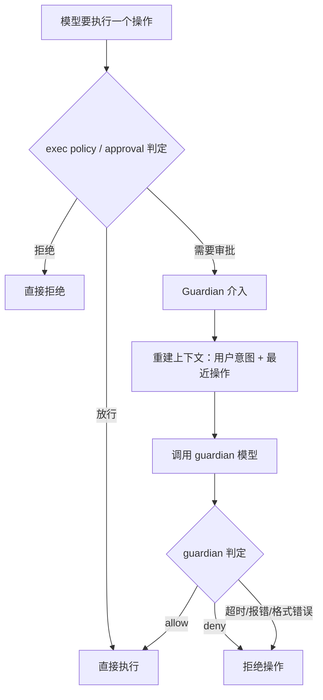

你让 Codex 自己干活，approval policy 设得比较宽松。它跑得很快——一个 turn 里可能执行 20 条命令。然后你发现一个问题：其中有些命令你其实想看一眼再决定要不要跑。

比如 `git push --force`。沙箱不会拦它（它不破坏文件系统），exec policy 也不会拦它（它不在黑名单里）。但你真的希望 agent 未经确认就 force push 吗？

反过来，如果你把 approval_policy 设成“每条命令都问我”，那 20 条命令就要点 20 次“确认”。你本来设宽松策略就是为了不点这些按钮。

这就是**审批疲劳**的困境：全放行不安全，全审批太烦。需要一个中间地带。

## Guardian：一个专门做判断的模型

Codex 的解法是引入一个独立的 guardian 模型。它不做代码修改，不执行命令——它只做一件事：看到待审批的操作 + 用户意图 + 最近的操作历史，然后回答"这个操作符合用户意图吗？"



注意最后一条：**超时、报错、输出格式错误，一律 deny。** 这叫 fail closed——guardian 出问题时不会静默放行。宁可多问一次用户，不可漏过一次危险操作。

## Guardian 看到什么？

它不看全部对话历史（太长了）。它看的是一个精心压缩的版本：

- 用户消息：单独的 10k token 预算，每条上限 2000 token，优先保留首尾锚点
- 工具消息：单独的 10k token 预算，每条上限 1000 token
- 最近的非用户条目：最多 40 条
- 待审批的具体操作

然后它返回结构化 JSON：risk_level + outcome（allow/deny）+ rationale。不是自由文本——必须是严格的结构化输出，解析失败就当 deny 处理。

## 熔断器：防止死循环

有一个边界情况：模型反复尝试同一个操作，guardian 反复拒绝。如果不管，就会无限循环——模型试、guardian 拒、模型换个姿势再试、guardian 再拒……消耗 token 但永远不前进。

Codex 设了一个熔断器：**同一个 turn 内，guardian 连续拒绝 3 次，或者最近 50 次审查中拒绝达到 10 次，就中断当前 Turn。**

```rust
pub(crate) const MAX_CONSECUTIVE_GUARDIAN_DENIALS_PER_TURN: u32 = 3;
pub(crate) const MAX_RECENT_AUTO_REVIEW_DENIALS_PER_TURN: u32 = 10;
pub(crate) const AUTO_REVIEW_DENIAL_WINDOW_SIZE: usize = 50;
```

注意：熔断的结果是 **abort turn**，不是"升级给用户"。系统发送一条 GuardianWarning，然后中断当前 Turn。用户看到的是 turn 被终止，而不是一个"是否继续"的弹框。

## Guardian 管什么？

它处理的不只是 shell 命令。审批请求的枚举包括：

- Shell / ExecCommand（命令执行）
- ApplyPatch（文件修改）
- NetworkAccess（网络访问）
- McpToolCall（MCP 工具调用）
- RequestPermissions（权限请求）

Guardian 处理的是灰色地带：**技术上允许，但需要判断是否合理。**"能不能做"由沙箱和 exec policy 硬拦截；"该不该做"由 guardian 软判断。

## 代价

- 每次审批都是一次模型调用——有延迟（超时上限 90 秒）和 token 成本
- Guardian 也是 LLM，会误判——可能错误地 allow 一个危险操作，或错误地 deny 一个安全操作
- 慢网络下 90 秒超时意味着用户可能等很久

但对比替代方案（每条命令都弹框让用户确认），guardian 把 20 次人工审批减少到 0-2 次。对于高频操作的 coding agent，这个差距决定了宽松 approval policy 是否可用。

## 回到审批疲劳

现在你能理解 guardian 的位置了。它不能替代沙箱（那是硬边界），但它直接参与高风险操作的审批决策——fail-closed、风险评估、熔断中断都是安全行为。同时它也是体验机制：让"安全"和"不打扰用户"可以同时成立。

没有 guardian，宽松的 approval policy 要么不安全（全放行），要么不可用（全审批）。有了 guardian，大部分"安全但需要确认"的操作被自动处理，只有真正可疑的才会中断 turn。

---

源码快照：`openai/codex` @ `841e47b8fb`（`codex-rs/core/src/guardian/mod.rs`、`guardian/review.rs`、`guardian/approval_request.rs`）
