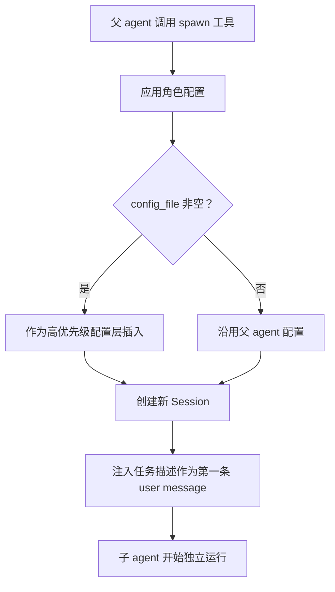

假设你让 Codex 重构一个大型 monorepo。任务太复杂，一个 agent 忙不过来，于是它决定 spawn 几个子 agent 并行工作：一个去搞清楚认证模块的依赖关系，一个去改数据库层的接口，一个去跑测试。问题来了——这三个子 agent 应该是"同一种东西的三个实例"，还是"三种不同的东西"？

如果你设计过微服务，直觉会告诉你：它们应该是不同的。explorer 只负责读代码、回答问题，不应该有写权限；worker 负责改代码，但不应该做架构决策。每个角色有独立的权限边界，就像每个服务有独立的 API 一样。

Codex 没有这样做。它的选择让我第一次看源码时有点意外。

## 角色不是给子 agent 看的，是给父 agent 看的

我们先搞清楚一件事：当 Codex 说"角色"时，这个信息到底去了哪里？

答案是一条单向链路：角色定义（name + description）→ 拼接成文本 → 塞进 spawn 工具的 description → **父 agent 看到工具描述** → 父 agent 决定用哪个角色 spawn → 子 agent 被创建 → 子 agent 不知道自己是什么角色。

注意终点：角色的 description 最终出现在**父 agent 的工具描述**里，而不是子 agent 的 system prompt 里。父 agent 看到"Available roles: explorer - 用于代码库问题…"这段文字后，自己决定"我应该 spawn 一个 explorer"。

子 agent 呢？角色的 description 不会注入它的 system prompt。没有额外的行为约束，没有权限收窄。但角色不是完全丢弃的——它写入 SessionSource 元数据，V2 恢复时会根据 role 重新应用配置。行为差异来自 role config（配置文件），而不是名字本身。

换句话说，Codex 的“角色”不是子 agent 的身份，而是父 agent 的使用说明书。这就像餐厅菜单上写的“推荐搭配”——它告诉点菜的人怎么选，但厨房不会因为菜单上写了“清淡”就少放盐。

## 那么 explorer.toml 里到底写了什么？

知道了角色只是 description 文本后，我们来看看内建角色。Codex 有三个：

| 角色 | description 要点 | config_file |
|------|-----------------|-------------|
| `default` | "Default agent." | 无 |
| `explorer` | 用于代码库问题，快速、权威，鼓励并行 spawn | `explorer.toml` |
| `worker` | 用于执行工作，强调文件所有权、不要 revert 别人的修改 | 无 |

explorer 有一个 `config_file`。我们可能会期待里面写了一些特殊配置——比如禁用写工具、换一个更快的模型、降低 reasoning effort。

打开一看：

```rust
// codex-rs/core/src/agent/builtins/explorer.toml
// （文件内容：空）
```

空的。一个字节都没有。

这意味着 explorer 和 default 在运行时**完全相同**——相同的模型、相同的工具、相同的权限、相同的沙箱。唯一的区别是父 agent 看到的 description 不同。description 里写了"Explorers are fast and authoritative"，但系统层面没有任何机制保证这一点。

说实话，第一次看到这个空文件时我觉得这是个 bug，或者是个还没实现的 TODO。从当前实现推测，系统没有为 explorer 配置任何行为收窄——它把选择权交给模型：如果模型认为某个任务适合用 explorer，它就 spawn 一个 explorer。但这不意味着系统“无法”收窄——未来的 role config、工具集或 permission profile 都可以做到。当前只是没有这样配置。

## 但 spawn 过程确实做了一些事

虽然角色本身只是文本，spawn 过程并不是简单的“复制一个 Session”。当父 agent 调用 spawn 工具时，系统做三件事：



这里有一个容易忽略的细节：配置继承是“保守”的。如果角色的 config_file 没有显式指定模型，子 agent 会沿用父 agent 的 model、model_provider、service_tier。为什么？因为如果用户正在用一个高级模型，spawn 出来的子 agent 不应该悄悄降级到默认模型。没有明确说的，就沿用父 agent 的。

如果你想看这一步的具体实现，核心是 `apply_role_to_config`（`codex-rs/core/src/agent/role.rs:38`）：它解析角色名、加载 config_file、调用 `build_next_config` 做层合并。保留逻辑在 `reload_overrides` 里——只有角色层显式设置了 `model` 字段，才会覆盖父 agent 的模型选择。

## 那谁来防止无限 spawn？

角色系统这么轻量，会不会出问题？最容易想到的是：一个 agent spawn 子 agent，子 agent 又 spawn 孙 agent，无穷无尽。

Codex 的 V1 多 agent 用一个极其简单的深度计数来解决：

```rust
// codex-rs/core/src/agent/registry.rs:70-76
pub(crate) fn next_thread_spawn_depth(session_source: &SessionSource) -> i32 {
    session_depth(session_source).saturating_add(1)
}

pub(crate) fn exceeds_thread_spawn_depth_limit(depth: i32, max_depth: i32) -> bool {
    depth > max_depth
}
```

每个子 agent 的 SessionSource 记录了它被 spawn 时的深度。超过上限就拒绝。

V2 多 agent 没有这个深度检查。它用另一套机制控制资源：resident capacity（同时存活的 agent 数量上限）和 LRU 驱逐（ch11）。深度限制对 V1 够用，V2 的容量模型更关心"同时有多少个在跑"而不是"嵌套了几层"。

## 这个设计到底在赌什么？

回顾整个角色系统，Codex 做了一个非常激进的赌注：**模型能根据 description 正确使用 spawn 工具。**

它赌的是：
- 父 agent 看到"explorer 用于代码库问题"后，真的只在需要问代码库问题时 spawn explorer
- 父 agent 看到"鼓励并行 spawn"后，真的会在有多个独立问题时并行 spawn
- 子 agent 虽然不知道自己是什么"角色"，但因为收到的任务描述足够明确，行为自然符合预期

这个赌注的代价是：系统层面没有任何强制隔离。如果模型决定用 explorer 去删文件，没有任何机制阻止它（当然，沙箱会限制它能删什么）。

但收益也很明显：添加一个新角色，如果只需要给父 agent 一个选择提示，写一段 description 就够了。如果角色需要不同的模型、reasoning effort 或其他配置差异，再加一个 `config_file`。不需要新的 handler、新的权限模型、新的运行时分支。整个角色系统的代码量很小。

如果你要做类似的设计，关键判断是：你的"角色"之间的差异是**配置差异**还是**行为差异**？如果是配置差异（不同模型、不同工具集），Codex 这套 description + config overlay 就够了。如果是行为差异（不同的决策逻辑、不同的输出约束），你需要更重的机制——不同的 system prompt、不同的工具白名单、甚至不同的模型。Codex 选择了最轻的那条路，因为它信任模型能根据任务描述自行调整行为。这个信任是否合理，取决于你用的模型有多强。

---

源码快照：`openai/codex` @ `841e47b8fb`（`codex-rs/core/src/agent/role.rs`、`codex-rs/core/src/agent/control/spawn.rs`、`codex-rs/core/src/agent/registry.rs`）
