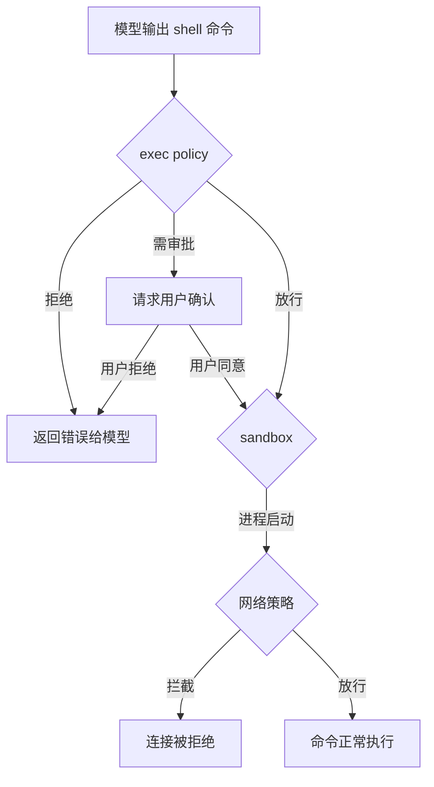

## 设计问题

LLM 输出了一个 shell 命令。系统怎么知道这个命令是安全的？如果模型被 prompt injection 攻击，输出了恶意命令，谁来兜底？

## 直觉答案 vs 实际选择

直觉上，维护一个命令白名单，不在白名单里的拒绝执行。简单直接。

Codex 的实际选择是：**三层防线，每层解决不同粒度的问题。** exec policy 管"什么命令可以跑"，sandbox 管"命令能碰什么资源"，网络策略管"命令能访问什么地址"。三层独立配置、独立生效，任何一层都能独立阻止危险操作。

## 第一层：exec policy（命令级）

```rust
// codex-rs/core/src/exec_policy.rs:277
pub(crate) struct ExecPolicyManager {
    policy: RwLock<Arc<Policy>>,
}
```

exec policy 是一个规则引擎，对每条命令做匹配：

- 白名单命令（`cargo build`、`git status`）：直接放行
- 黑名单命令（`rm -rf /`、`curl | bash`）：直接拒绝
- 未匹配命令：根据 approval_policy 决定是自动放行还是请求用户审批

关键设计：exec policy 可以被运行时修改（`append_amendment_and_update`）。用户审批通过一条命令后，系统可以把它加入白名单，后续不再询问。

## 第二层：sandbox（进程级）

即使命令本身是"安全的"（比如 `cargo build`），它执行时也可能做危险的事（比如 build script 里写恶意代码）。sandbox 在 OS 级别限制进程能碰什么：

| 平台 | 技术 | 隔离内容 |
|------|------|----------|
| Linux | bubblewrap + landlock | 文件系统（只读挂载 + 写白名单）、网络、进程 |
| macOS | seatbelt (sandbox-exec) | 文件系统、网络 |
| Windows | windows-sandbox | 文件系统、注册表 |

```rust
// codex-rs/sandboxing/src/lib.rs 的模块结构
// bwrap.rs    — Linux bubblewrap 封装
// seatbelt.rs — macOS sandbox-exec 封装
// landlock.rs — Linux landlock LSM
// windows.rs  — Windows 沙箱
// manager.rs  — 统一的沙箱管理器
```

sandbox 的核心约束：

- **文件系统**：工作目录可写，其他目录只读或不可见
- **网络**：默认禁止所有出站连接，白名单放行
- **进程**：不能 fork 出沙箱外的进程

## 第三层：网络策略

```rust
// codex-rs/core/src/network_policy_decision.rs
// 决定一个网络请求是否被允许
```

网络策略独立于文件系统沙箱。即使沙箱允许了网络访问，网络策略仍然可以按域名/IP 粒度拦截。

## 三层如何协作



三层是串行的：exec policy 先过，然后 sandbox 包裹进程，然后网络策略过滤出站连接。任何一层拒绝，操作就失败。

## 取舍

**得到什么**：

- 纵深防御——即使一层被绕过，其他层仍然有效
- 全自动执行成为可能——在 sandbox 内，模型可以自由执行命令而不需要用户逐条审批
- 平台适配——每个 OS 用最原生的隔离技术，不依赖通用方案

**放弃什么**：

- 模型能做的事被限制——不能 `npm install`（网络被禁）、不能写工作目录外的文件
- 三套沙箱实现需要维护——Linux/macOS/Windows 各一套
- 沙箱逃逸风险——bubblewrap 和 seatbelt 都有历史漏洞，不是绝对安全

## 对读者的启示

如果你的 agent 系统不需要执行任意命令（比如只做文本生成），不需要沙箱。但如果是 coding agent（必须执行 build、test、git），沙箱是"让模型自由行动"的前提条件。

核心洞察：**沙箱不是限制模型，而是让模型可以被信任。** 没有沙箱，每条命令都要人工审批，agent 就退化成了"命令建议器"。有了沙箱，agent 才能真正自主执行，用户只需要看结果。

---

源码快照：`openai/codex` @ `841e47b8fb`（`codex-rs/core/src/exec_policy.rs`、`codex-rs/sandboxing/src/`、`codex-rs/linux-sandbox/src/`）
