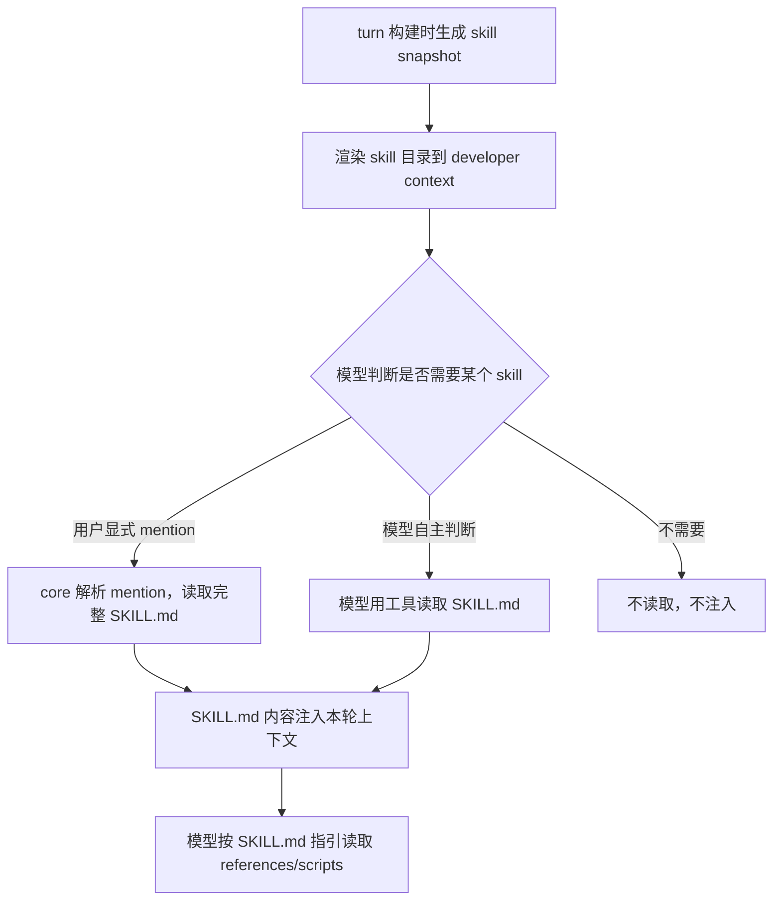

## 设计问题

用户想教 agent 一种新能力——比如"按照我们团队的代码风格写 React 组件"。这个能力应该以什么形式存在？一个 Python 插件？一个 API endpoint？一个配置文件？

## 直觉答案 vs 实际选择

直觉上，扩展能力应该用代码——写一个插件，注册到 agent 的工具列表里，agent 调用时执行插件逻辑。像 VS Code 的 extension 那样。

Codex 的实际选择是：**skill 就是一个 `SKILL.md` 文件。** 没有运行时、没有 API、没有依赖。它的全部"执行"就是被读取后注入模型的上下文。skill 不是代码扩展，而是**文档扩展**。

## 渐进式披露：目录先行，正文按需

skill 机制的核心设计是三层渐进式披露：



**第一层：目录。** 每个 turn 开始时，系统把所有可用 skill 的 name + description + source locator 渲染成一段目录文本，放进 developer context。模型看到的是"有哪些 skill 可用"，而不是 skill 的完整内容。

```rust
// codex-rs/core-skills/src/render.rs:167-183
const DEFAULT_SKILL_METADATA_CHAR_BUDGET: usize = 8_000;
const SKILL_METADATA_CONTEXT_WINDOW_PERCENT: usize = 2;

pub fn default_skill_metadata_budget(context_window: Option<i64>) -> SkillMetadataBudget {
    context_window
        .and_then(|window| usize::try_from(window).ok())
        .filter(|window| *window > 0)
        .map(|window| {
            SkillMetadataBudget::Tokens(
                window
                    .saturating_mul(SKILL_METADATA_CONTEXT_WINDOW_PERCENT)
                    .saturating_div(100)
                    .max(1),
            )
        })
        .unwrap_or(SkillMetadataBudget::Characters(DEFAULT_SKILL_METADATA_CHAR_BUDGET))
}
```

目录的 token 预算是上下文窗口的 2%（无窗口信息时退回 8000 字符）。这个约束保证了 skill 目录不会吞掉主要任务上下文。

**第二层：正文。** 只有当 skill 被选中（用户 mention 或模型自主判断）后，完整的 `SKILL.md` 才被读取并注入。

**第三层：引用。** `SKILL.md` 里可能引用 `references/`、`scripts/`、`assets/`。模型按文档中的路由说明，用工具按需读取。

## 谁来决定用哪个 skill？

Codex 把"语义匹配"留给模型，而不是在 core 里实现一个 skill 检索系统。判断规则直接写进 developer instructions：

```text
- Trigger rules: If the user names a skill (with `$SkillName` or plain text)
  OR the task clearly matches a skill's description shown above, you must use
  that skill for that turn.
- How to use a skill (progressive disclosure):
  1) After deciding to use a skill, the main agent must read its SKILL.md
     completely before taking task actions.
  2) When SKILL.md references another resource, use the same access mechanism.
- Coordination and sequencing:
  - If multiple skills apply, choose the minimal set that covers the request.
```

用户显式 mention 时，core 会在模型采样前解析并注入：

```rust
// codex-rs/core/src/session/turn.rs::build_skills_and_plugins（节选）
let mentioned_skills = collect_explicit_skill_mentions(
    &user_input,
    &skills_outcome.skills,
    &skills_outcome.disabled_paths,
    &connector_slug_counts,
);
let SkillInjections { items: skill_injections, warnings: skill_warnings } =
    build_skill_injections(&mentioned_skills, Some(skills_outcome), ...).await;
```

命名冲突处理很保守：如果一个名字同时匹配多个 skill，或者和 app connector slug 冲突，宁可不选也不注入错误的 skill。

## Skill 的更新：watcher + cache 失效

```rust
// codex-rs/app-server/src/skills_watcher.rs（节选）
const WATCHER_THROTTLE_INTERVAL: Duration = Duration::from_secs(10);

// 文件变化后：
skills_service.clear_cache();
outgoing.send_server_notification(ServerNotification::SkillsChanged(...)).await;
```

本地环境有 file watcher，约 10 秒节流后清空 skill cache 并通知客户端。但有一个重要边界：**当前 active turn 持有的 snapshot 不会自动突变。** 变化影响的是后续 turn 的 snapshot 构建。

## 为什么不用插件代码？

| 维度 | 插件代码 | Markdown skill |
|------|----------|---------------|
| 安全审计 | 需要代码审查、沙箱执行 | 人类直接阅读 |
| 依赖管理 | 需要 package manager、版本锁定 | 零依赖 |
| 创建门槛 | 需要会编程、了解 API | 会写文档就行 |
| 运行时能力 | 可以调 API、改状态 | 不能——只是 prompt 文本 |
| 错误模式 | 代码 bug 可能导致系统崩溃 | 最坏情况是模型行为不佳 |

## 取舍

**得到什么**：

- 零门槛扩展——任何人写一个 `SKILL.md` 就能教 agent 新能力
- 人类可审计——skill 的全部内容就是文本，没有隐藏行为
- 不引入新的运行时——不需要插件加载器、沙箱、依赖解析
- 渐进式披露保护上下文——不用的 skill 不占 token

**放弃什么**：

- skill 没有运行时能力——不能调 API、不能修改系统状态、不能执行代码
- 依赖模型遵守 skill 指令——skill 的"规则"只是 prompt 文本，不是硬约束
- 语义匹配不精确——模型可能忽略应该使用的 skill，或错误使用不相关的 skill

## 对读者的启示

如果你的 agent 需要"教它做事的方法"（代码风格、工作流程、领域知识），markdown skill 是最轻量的方案。但如果需要"给它新的能力"（调用新 API、操作新系统），你需要 MCP 或插件——那是下一章的主题。

核心洞察：**skill 把"扩展 agent"从"写代码"降格为"写文档"。** 这不是能力的扩展，而是知识的注入。它的有效性完全取决于模型是否能正确理解和遵循文档中的指令。

---

源码快照：`openai/codex` @ `841e47b8fb`（`codex-rs/core-skills/src/render.rs`、`codex-rs/core-skills/src/injection.rs`、`codex-rs/core/src/session/turn.rs`、`codex-rs/app-server/src/skills_watcher.rs`）
