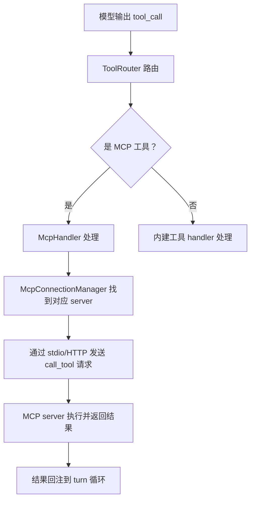

## 设计问题

skill 只能注入知识，不能执行代码。如果用户想让 agent 调用 GitHub API、操作数据库、或者使用自定义的部署工具，怎么办？这些能力需要真正的运行时——进程、网络连接、API 调用。

## 直觉答案 vs 实际选择

直觉上，让第三方写一个动态库或脚本，agent 在沙箱里加载执行。像 IDE 插件那样。

Codex 的实际选择是：**采用 MCP（Model Context Protocol）作为外部工具的标准接入协议。** 第三方工具作为独立的 MCP server 进程运行，通过 stdio 或 HTTP 与 agent 通信。agent 只看到工具的 schema（name + description + parameters），不知道工具的实现语言、运行位置或内部逻辑。

## MCP 的接入架构



`McpConnectionManager` 管理所有活跃的 MCP server 连接：

```rust
// codex-rs/codex-mcp/src/connection_manager.rs:116-124
pub struct McpConnectionManager {
    clients: HashMap<String, AsyncManagedClient>,
    server_metadata: HashMap<String, McpServerMetadata>,
    required_servers: Vec<String>,
    tool_plugin_provenance: Arc<ToolPluginProvenance>,
    prefix_mcp_tool_names: bool,
    elicitation_requests: ElicitationRequestManager,
    startup_cancellation_token: CancellationToken,
}
```

每个 MCP server 是一个独立的进程。`clients` 维护 server name → 客户端连接的映射。`required_servers` 标记哪些 server 是必须成功启动的——如果 required server 启动失败，整个 session 报错。

## 工具暴露：从 MCP tool 到模型可见的 tool spec

MCP server 注册的工具不是直接暴露给模型的。`build_mcp_tool_runtimes` 做过滤和转换：

```rust
// codex-rs/core/src/mcp_tool_exposure.rs:20-56（节选）
pub(crate) fn build_mcp_tool_runtimes(
    all_mcp_tools: &[McpToolInfo],
    connectors: Option<&[connectors::AppInfo]>,
    config: &Config,
    search_tool_enabled: bool,
) -> Vec<Arc<dyn CoreToolRuntime>> {
    let mut exposed_tools = filter_non_codex_apps_mcp_tools_only(all_mcp_tools);
    if let Some(connectors) = connectors {
        exposed_tools.extend(filter_codex_apps_mcp_tools(all_mcp_tools, connectors, config));
    }
    let exposure = if search_tool_enabled {
        ToolExposure::Deferred
    } else {
        ToolExposure::Direct
    };
    exposed_tools.into_iter().filter_map(|tool| {
        match McpHandler::new(tool) {
            Ok(handler) => Some(override_tool_exposure(Arc::new(handler), exposure)),
            Err(err) => { warn!("Skipping MCP tool: {err}"); None }
        }
    }).collect()
}
```

两个关键过滤：

1. **可见性过滤**：`tool_is_model_visible` 检查工具的 meta 中是否标记了 model 可见性。不可见的工具不进入模型的 tool list。
2. **暴露模式**：如果启用了 search tool（`ToolExposure::Deferred`），MCP 工具不直接出现在 tool list 里，而是通过搜索按需发现。

## 审批：MCP 工具调用不是无条件执行的

MCP 工具调用经过和内建工具相同的审批流程。`mcp_tool_call.rs` 在执行前检查：

- **exec policy**：MCP 工具是否在白名单中
- **guardian 审批**：如果 approval_policy 要求审批，构造 `GuardianApprovalRequest::McpToolCall` 发给 guardian
- **用户审批**：guardian 拒绝或不可用时，升级给用户

```rust
// codex-rs/core/src/mcp_tool_call.rs 的 import 列表（节选）
use crate::guardian::GuardianApprovalRequest;
use crate::guardian::review_approval_request;
use crate::guardian::routes_approval_to_guardian_with_reviewer;
```

MCP 工具不因为是"外部的"就获得更宽松或更严格的审批——它和内建工具走同一条审批链路。

## 插件系统：MCP 之上的管理层

`PluginsManager` 在 MCP 之上提供了一层管理抽象：

- **发现**：从配置中读取 plugin 定义，解析出 MCP server 配置
- **生命周期**：管理 plugin 的安装、启用、禁用
- **skill 集成**：plugin 可以携带 skill（`plugin_skill_snapshots`）

plugin 不是另一种工具协议——它是 MCP server 的打包和分发方式。一个 plugin 就是一个预配置的 MCP server + 可选的 skill 文件。

## 取舍

**得到什么**：

- 标准化协议——任何语言实现的 MCP server 都能接入，不依赖 agent 的运行时
- 进程隔离——MCP server 是独立进程，崩溃不影响 agent 主进程
- 生态独立演进——工具开发者不需要了解 agent 内部，只需实现 MCP 协议
- 统一审批——MCP 工具不绕过安全机制

**放弃什么**：

- 间接层增加延迟——每次工具调用都要跨进程通信（stdio/HTTP）
- 调试复杂度——问题可能在 agent、MCP client、MCP server 三层中的任何一层
- 启动成本——每个 MCP server 是独立进程，需要启动时间
- 能力受限于协议——MCP 协议不支持的功能（如流式输出、双向交互）无法使用

## 对读者的启示

如果你的 agent 需要接入外部工具，MCP 是目前最标准化的选择。但要注意：MCP 解决的是"工具接入"问题，不是"工具安全"问题。一个恶意的 MCP server 仍然可能返回误导性结果。审批机制能控制"是否调用"，但不能控制"调用结果是否可信"。

核心洞察：**MCP 把"工具实现"和"工具使用"彻底解耦。** agent 不需要知道工具是怎么实现的，工具不需要知道 agent 的内部结构。这种解耦让工具生态可以独立于 agent 演进——但代价是每次调用都多了一层进程间通信。

---

源码快照：`openai/codex` @ `841e47b8fb`（`codex-rs/codex-mcp/src/connection_manager.rs`、`codex-rs/core/src/mcp_tool_exposure.rs`、`codex-rs/core/src/mcp_tool_call.rs`）
