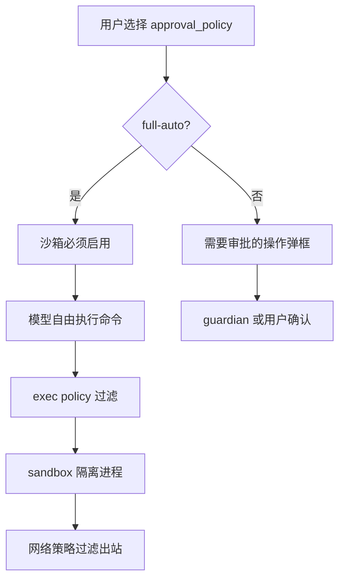

## 设计问题

前 14 章分别看了 Session/Turn、模型调用、工具循环、上下文工程、沙箱、审批、多 agent、skill、MCP、配置层。这些独立的设计决策背后，有没有一条统一的思想？如果有，它适合什么场景、不适合什么场景？

## 一条主线：受控自主

全书的主线问题是：**如何在沙箱安全约束下，让 LLM 拥有尽可能大的代码修改自主权？**

Codex 的回答可以概括为三个字：**受控自主**。

- **自主**：在沙箱内，模型可以自由执行命令、读写文件、spawn 子 agent，不需要逐条审批
- **受控**：沙箱是硬边界，exec policy 是命令级过滤，guardian 是意图级审批，配置层是行为定制

这不是"先让模型做，再检查结果"，而是"先画好边界，再让模型在边界内自由行动"。

## 内核只做三件事

回看整个架构，Codex 的内核（`codex-rs/core`）只做三件事：

1. **管生命周期**：Session 拥有状态，Turn 是有界执行单元，input queue 串行化输入
2. **构造上下文**：每步装配 system prompt + environment context + world state，compaction 控制窗口
3. **执行工具**：ToolRouter 路由，RwLock 门控并行，结果回注 turn 循环

其他一切——沙箱、guardian、MCP、skill、多 agent——都是这三件事的**扩展或约束**。沙箱约束工具执行，guardian 约束审批，MCP 扩展工具集，skill 扩展上下文，多 agent 扩展执行容量。

## 安全不是事后加的

很多 agent 系统的安全模型是"先做功能，再加审批"。Codex 不是。沙箱是执行的前提条件——没有沙箱，就没有"全自动执行"这个模式。

这个设计的含义是：**安全等级不是"功能多少"的问题，而是"边界在哪"的问题。** full-auto 模式不是"去掉所有安全检查"，而是"把安全检查从交互层移到基础设施层"。用户不再逐条审批，但沙箱仍然在。

## 与同类系统的设计对比

| 维度 | Codex | Claude Code | Cursor | Aider |
|------|-------|-------------|--------|-------|
| 执行模型 | 沙箱内全自动 | 权限提示 | IDE 内操作 | diff 应用 |
| 安全边界 | OS 级沙箱（bwrap/seatbelt） | 用户审批 | IDE 沙箱 | 无（依赖 git） |
| 上下文管理 | 自动 compaction + baseline/diff | 手动 /compact | 固定窗口 | repo map |
| 多 agent | V1/V2 协议，LRU 驱逐 | 无 | 无 | 无 |
| 扩展方式 | skill（文档）+ MCP（协议） | 无 | extension | 无 |
| 配置 | 多层配置栈 + AGENTS.md | 单层 | settings | .aider.conf |

核心区别：Codex 是一个**运行时**（runtime），不是一个**工具**（tool）。它管理 agent 的完整生命周期——从 session 创建到 turn 执行到上下文压缩到子 agent 回收。其他系统更接近"LLM + 一些工具"的组合。

## 这套架构适合什么

**适合**：

- 需要执行任意命令的 coding agent（build、test、git、deploy）
- 面向非技术用户（不能让用户逐条审批 shell 命令）
- 需要企业管控（MDM 推送策略、网络白名单）
- 需要多 agent 并行（大任务分治）
- 需要可审计（所有操作有 rollout 记录）

**不适合**：

- 纯文本生成（不需要沙箱、不需要工具执行）
- 实时交互（turn 模型是请求-响应，不是流式对话）
- 极简场景（多层配置、多 agent 协议是过度设计）
- 需要绝对安全（沙箱有历史漏洞，guardian 是 LLM 会误判）

## 如果要二次开发，优先改哪里

1. **加工具**：实现 `CoreToolRuntime` trait，注册到 ToolRouter。这是最常见的扩展点。
2. **改上下文**：修改 `build_initial_context` 或添加新的 WorldState section。影响模型"看到什么"。
3. **改审批**：修改 exec policy 规则或 guardian prompt。影响"什么操作需要确认"。
4. **加角色**：在 `built_in::configs()` 里加一个 `AgentRoleConfig`。影响多 agent 的分工方式。
5. **改 compaction**：修改 `compact.rs` 的触发条件或摘要策略。影响长对话的质量。

不建议改的：Session/Turn 生命周期、配置层合并逻辑、沙箱实现。这些是承重墙，改动风险极高。

## 最后一个取舍

Codex 用 Rust 写核心，用 TypeScript 写 CLI 和 IDE 集成。这不是偶然：

- Rust 保证了内存安全和性能——agent 运行时是长生命周期进程，内存泄漏和 data race 是致命的
- TypeScript 保证了生态兼容——IDE 插件、npm 包、Web UI 都在 JS 生态里

这个语言选择的取舍是：**开发速度 vs 运行时可靠性。** Rust 写得慢，但 agent 运行时一旦崩溃，用户的工作就丢了。对于"基础设施"级别的软件，运行时可靠性比开发速度重要。

---

源码快照：`openai/codex` @ `841e47b8fb`（全仓库架构层面的综合判断）
