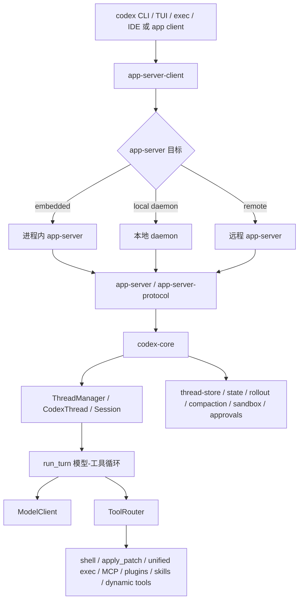

<section className="originalQuestionBox" aria-label="原始问题">
  <div className="originalQuestionLabel">原始问题</div>
  <blockquote>
    从代码的角度，介绍一下codex的架构、模块，整体架构是什么样的，有什么模块，每个模块是做什么的。核心是哪个模块，历史commit中看哪个模块花的心血最多，哪个模块的复杂度最高最难，这些高复杂度的设计是为了解决什么问题
  </blockquote>
</section>

## 先回答

Codex 不是一个“终端聊天 UI 加几个工具调用”的项目。当前源码里更准确的心智模型是：**Codex 是一个线程化的本地 agent runtime，上面接 CLI、TUI、exec、IDE/app-server 等不同客户端**。



如果只问“核心模块是谁”，答案是 `codex-rs/core`。更具体一点，核心链路是：

```text
ThreadManager
  -> CodexThread
    -> Session
      -> session::turn::run_turn
        -> ModelClientSession
        -> ToolRouter
        -> ContextManager / compaction / rollout / approvals / sandbox
```

`tui` 当前体量也很大，但它的复杂度主要来自终端交互：输入框、历史渲染、审批弹窗、diff、状态栏、resume/fork 选择器、布局和各种终端兼容。真正把 Codex 变成 coding agent 的，是 `core` 里对线程、上下文、模型采样、工具执行、安全审批、沙箱、持久化和压缩的统一调度。

下文源码均为删节片段：保留承重字段、状态边界和生命周期调用，省略 import、错误处理和低信息量包装。

## 1. 模块不是按功能平铺，而是按运行边界分层

| 模块 | 主要职责 | 架构位置 |
| --- | --- | --- |
| `codex-rs/cli` | 顶层命令分发：interactive、exec、review、login、MCP、plugin、app-server、resume/fork/archive 等 | 用户入口 |
| `codex-rs/tui` | 终端 UI：输入、渲染、审批、diff、状态、历史、resume/fork 选择 | 交互客户端 |
| `codex-rs/exec` | 非交互执行模式，把一次 prompt 跑成可脚本化结果 | 交互客户端的另一种形态 |
| `codex-rs/app-server-client` | 统一 embedded / daemon / remote app-server 调用 | 客户端到服务端的适配层 |
| `codex-rs/app-server` | JSON-RPC/连接/请求分发/thread 生命周期通知 | 服务化边界 |
| `codex-rs/app-server-protocol` | app-server v2 线程、turn、realtime、history、通知协议 | 跨客户端 API 合约 |
| `codex-rs/protocol` | core 内部 `Op` / `EventMsg` / `Submission` 协议 | runtime 事件模型 |
| `codex-rs/core` | agent runtime：线程、会话、turn loop、上下文、工具、安全、压缩、持久化 | 核心 |
| `codex-rs/exec-server`、`sandboxing`、`linux-sandbox`、`windows-sandbox-rs` | 命令执行、PTY、沙箱和平台隔离 | 工具执行边界 |
| `codex-rs/thread-store`、`state`、`rollout`、`rollout-trace` | 线程历史、状态数据库、resume/fork、trace | 持久化边界 |
| `codex-rs/core-plugins`、`plugin`、`skills`、`core-skills`、`codex-mcp` | 插件、技能、MCP 工具和资源暴露 | 扩展边界 |

这个分层说明了一个重要判断：Codex 的目录多，不是因为把一个 CLI 拆碎了，而是因为它已经把“终端产品”和“agent runtime”分开。TUI 只是一个客户端，`core` 才是让模型持续操作真实工作区的运行时。

## 2. app-server 是为了让同一个 runtime 服务多个客户端

`tui` 里有三种 app-server 目标：进程内、本地 daemon、远程。这是一个关键架构信号：Codex 不再把 TUI 当作唯一宿主。

出处：`codex-rs/tui/src/lib.rs`

```rust
pub(crate) enum AppServerTarget {
    Embedded,
    LocalDaemon { endpoint: RemoteAppServerEndpoint },
    Remote { endpoint: RemoteAppServerEndpoint },
}

impl AppServerTarget {
    fn thread_params_mode(&self) -> ThreadParamsMode {
        if self.uses_remote_workspace() {
            ThreadParamsMode::Remote
        } else {
            ThreadParamsMode::Embedded
        }
    }
}
```

这段不是 UI 细节。它说明 Codex 要支持不同运行拓扑：本地终端里直接跑、连接本地常驻服务、或者连接远程 workspace。这个选择会把很多复杂度推到协议层，因为客户端不能再依赖“我就在同一个进程里直接拿 Rust 对象”。

`app-server-protocol` 里的 `ThreadStartParams` 也能看出它承载的是稳定 API，而不是简单的 prompt 字符串。

出处：`codex-rs/app-server-protocol/src/protocol/v2/thread.rs::ThreadStartParams`

```rust
pub struct ThreadStartParams {
    pub model: Option<String>,
    pub model_provider: Option<String>,
    pub cwd: Option<String>,
    pub runtime_workspace_roots: Option<Vec<AbsolutePathBuf>>,
    pub approval_policy: Option<AskForApproval>,
    pub approvals_reviewer: Option<ApprovalsReviewer>,
    pub sandbox: Option<SandboxMode>,
    pub permissions: Option<String>,
    pub base_instructions: Option<String>,
    pub developer_instructions: Option<String>,
    pub personality: Option<Personality>,
    pub ephemeral: Option<bool>,
    pub history_mode: Option<ThreadHistoryMode>,
    pub environments: Option<Vec<TurnEnvironmentParams>>,
    pub dynamic_tools: Option<Vec<DynamicToolSpec>>,
    pub selected_capability_roots: Option<Vec<SelectedCapabilityRoot>>,
}
```

从这些字段可以读出 app-server 要解决的问题：模型、权限、沙箱、工作区 roots、环境、动态工具、历史契约都必须在线程启动时成为显式协议。否则 TUI、IDE、远程 app、exec 很容易各自长出一套不兼容的启动语义。

## 3. core 的核心对象是 thread，不是一次 chat completion

`ThreadManager` 负责创建和维护线程。它持有 auth、模型管理、环境管理、skills、plugins、MCP、thread store 等共享服务。

出处：`codex-rs/core/src/thread_manager.rs`

```rust
/// [`ThreadManager`] is responsible for creating threads and maintaining
/// them in memory.
pub struct ThreadManager {
    state: Arc<ThreadManagerState>,
    _test_codex_home_guard: Option<TempCodexHomeGuard>,
}

pub(crate) struct ThreadManagerState {
    threads: Arc<RwLock<HashMap<ThreadId, Arc<CodexThread>>>>,
    auth_manager: Arc<AuthManager>,
    models_manager: SharedModelsManager,
    environment_manager: Arc<EnvironmentManager>,
    skills_service: Arc<SkillsService>,
    plugins_manager: Arc<PluginsManager>,
    mcp_manager: Arc<McpManager>,
    thread_store: Arc<dyn ThreadStore>,
}
```

`CodexThread` 则是线程级双向通道，向外暴露提交输入、读取事件、idle turn、历史读取、MCP 调用、配置快照等能力。

出处：`codex-rs/core/src/codex_thread.rs`

```rust
pub struct CodexThread {
    pub(crate) session: Arc<Session>,
    pub(crate) io: SessionIo,
    pub(crate) session_source: SessionSource,
    session_configured: SessionConfiguredEvent,
    rollout_path: Option<PathBuf>,
    out_of_band_elicitations: Mutex<OutOfBandElicitations>,
}

impl CodexThread {
    pub async fn submit(&self, op: Op) -> CodexResult<String> {
        self.io.submit(op).await
    }

    pub async fn next_event(&self) -> CodexResult<Event> {
        self.io.next_event().await
    }
}
```

这两个片段合起来说明：Codex 的基本运行单位不是“请求”，而是可恢复、可 fork、可订阅事件、可持续修改配置的 thread。

## 4. Session 才是真正的 runtime 状态机

`Session` 的注释直接给出关键边界：一个 session 最多一个 running task，但可以被用户输入中断。字段则展示了它同时管理运行状态、输入队列、实时对话、guardian 审查和共享服务。

出处：`codex-rs/core/src/session/session.rs`

```rust
/// Context for an initialized model agent
///
/// A session has at most 1 running task at a time, and can be interrupted by user input.
pub(crate) struct Session {
    pub(crate) thread_id: ThreadId,
    pub(crate) installation_id: String,
    pub(super) tx_event: Sender<Event>,
    pub(super) agent_status: watch::Sender<AgentStatus>,
    pub(super) state: Mutex<SessionState>,
    pub(crate) conversation: Arc<RealtimeConversationManager>,
    pub(crate) active_turn: Mutex<Option<ActiveTurn>>,
    pub(crate) input_queue: InputQueue,
    pub(crate) guardian_review_session: GuardianReviewSessionManager,
    pub(crate) services: SessionServices,
}
```

这也是 `core` 难的第一层原因：它要让“模型正在运行、用户又输入、工具还没返回、审批还在等、历史还要持久化、UI 还要持续收到事件”这些状态不互相踩踏。

## 5. `run_turn` 是模型-工具循环的发动机

一次 turn 不是调用一次模型。`run_turn` 先处理压缩、上下文捕获、world state 记录、skills/plugins 注入和 hooks，然后进入循环。循环内每次采样前都会重新取 history，构造 prompt，跑模型流式请求，处理工具调用和 pending input。

出处：`codex-rs/core/src/session/turn.rs::run_turn`

```rust
pub(crate) async fn run_turn(
    sess: Arc<Session>,
    turn_context: Arc<TurnContext>,
    turn_extension_data: Arc<codex_extension_api::ExtensionData>,
    input: Vec<TurnInput>,
    prewarmed_client_session: Option<ModelClientSession>,
    cancellation_token: CancellationToken,
) -> CodexResult<Option<String>> {
    let mut client_session =
        prewarmed_client_session.unwrap_or_else(|| sess.services.model_client.new_session());
    run_pre_sampling_compact(&sess, &turn_context, &mut client_session).await?;

    let first_step_context = sess.capture_step_context(Arc::clone(&turn_context)).await;
    let (mut world_state, display_roots) = tokio::join!(
        sess.record_context_updates_and_set_reference_context_item(first_step_context.as_ref()),
        turn_diff_display_roots(turn_context.as_ref()),
    );

    let Some((injection_items, explicitly_enabled_connectors)) =
        build_skills_and_plugins(&sess, first_step_context.as_ref(), &input, &cancellation_token).await
    else {
        return Ok(None);
    };
```

后半段的控制信号是 `needs_follow_up`。如果模型请求工具、返回 `end_turn=false`，或者有 pending input，Codex 就继续下一次采样；如果上下文压力过大，就在同一个 turn 中触发自动压缩。

出处：`codex-rs/core/src/session/turn.rs::run_turn`

```rust
let SamplingRequestResult {
    needs_follow_up: model_needs_follow_up,
    last_agent_message: sampling_request_last_agent_message,
} = sampling_request_output;

let has_pending_input = sess.input_queue.has_pending_input(&sess.active_turn).await;
let token_status = super::context_window::context_window_token_status(
    sess.as_ref(),
    turn_context.as_ref(),
).await;

let needs_follow_up = model_needs_follow_up || has_pending_input;
let should_roll_over = needs_follow_up
    && (sess.take_new_context_window_request().await || token_status.token_limit_reached);

if should_roll_over {
    run_auto_compact(..., CompactionReason::ContextLimit, CompactionPhase::MidTurn).await?;
    can_drain_pending_input = !model_needs_follow_up;
    continue;
}

if !needs_follow_up {
    last_agent_message = sampling_request_last_agent_message;
    break;
}
```

这里的复杂度是必要的。coding agent 的 turn 经常不是“模型说一句话就结束”，而是“模型请求 shell、shell 输出回来、模型继续推理、再 apply patch、再跑测试、用户中途补一句、上下文快满还要压缩”。`run_turn` 把这些事件收束成一个可取消、可记录、可继续的循环。

## 6. 工具系统用 ToolRouter 把模型输出和本地能力隔开

模型返回的 `ResponseItem` 不会直接执行。`ToolRouter` 先把它解析成 `ToolCall`，再通过 registry 分发给具体 runtime。

出处：`codex-rs/core/src/tools/router.rs`

```rust
pub struct ToolRouter {
    registry: ToolRegistry,
    model_visible_specs: Vec<ToolSpec>,
}

impl ToolRouter {
    pub(crate) fn from_context(
        step_context: &StepContext,
        params: ToolRouterParams<'_>,
        tool_search_handler_cache: &ToolSearchHandlerCache,
    ) -> Self {
        build_tool_router(step_context, params, tool_search_handler_cache)
    }

    pub(crate) fn build_tool_call(item: ResponseItem) -> Result<Option<ToolCall>, FunctionCallError> {
        match item {
            ResponseItem::FunctionCall { name, namespace, arguments, call_id, .. } => {
                let tool_name = ToolName::new(namespace, name);
                Ok(Some(ToolCall {
                    tool_name,
                    call_id,
                    payload: ToolPayload::Function { arguments },
                }))
            }
            ResponseItem::ToolSearchCall { call_id: Some(call_id), execution, arguments, .. }
                if execution == "client" => { ... }
            ResponseItem::CustomToolCall { name, namespace, input, call_id, .. } => { ... }
            _ => Ok(None),
        }
    }
}
```

这解释了为什么工具相关目录很多。Codex 要同时支持内建工具、MCP 工具、插件工具、动态工具、`tool_search`、并行工具调用、审批、取消和沙箱。直接让模型输出映射到本地执行会把安全边界打散，所以中间必须有路由、注册表和 runtime 上下文。

## 7. 协议层把输入和事件显式化

`codex-rs/protocol` 的 `Op` 和 `EventMsg` 是 core 的事件语言。客户端提交的是 `Op`，收到的是 `EventMsg`，而不是共享内部对象。

出处：`codex-rs/protocol/src/protocol.rs`

```rust
pub enum Op {
    Interrupt,
    CleanBackgroundTerminals,
    RealtimeConversationStart(ConversationStartParams),
    RealtimeConversationAudio(ConversationAudioParams),
    RealtimeConversationText(ConversationTextParams),
    RealtimeConversationClose,
    UserInput {
        items: Vec<UserInput>,
        final_output_json_schema: Option<Value>,
        responsesapi_client_metadata: Option<HashMap<String, String>>,
        additional_context: BTreeMap<String, AdditionalContextEntry>,
        thread_settings: ThreadSettingsOverrides,
    },
    ThreadSettings {
        thread_settings: ThreadSettingsOverrides,
    },
    ExecApproval { id: String, turn_id: Option<String>, decision: ReviewDecision },
    PatchApproval { id: String, decision: ReviewDecision },
    ResolveElicitation { ... },
    UserInputAnswer { ... },
}
```

出处：`codex-rs/protocol/src/protocol.rs::EventMsg`

```rust
pub enum EventMsg {
    Error(ErrorEvent),
    Warning(WarningEvent),
    ContextCompacted(ContextCompactedEvent),
    ThreadRolledBack(ThreadRolledBackEvent),
    TurnStarted(TurnStartedEvent),
    ThreadSettingsApplied(ThreadSettingsAppliedEvent),
    TurnComplete(TurnCompleteEvent),
    TokenCount(TokenCountEvent),
    AgentMessage(AgentMessageEvent),
    UserMessage(UserMessageEvent),
    AgentReasoning(AgentReasoningEvent),
    SessionConfigured(SessionConfiguredEvent),
    EnvironmentConnected(EnvironmentConnectionEvent),
    EnvironmentDisconnected(EnvironmentConnectionEvent),
    ThreadGoalUpdated(ThreadGoalUpdatedEvent),
}
```

这层协议的价值是把异步 runtime 的变化变成可订阅事件。UI 不需要猜模型现在在做什么，它只需要根据事件流更新状态；core 也不需要知道具体客户端如何渲染。

## 8. 历史 commit 看，`core` 花的心血最多

本章用本地 `openai/codex` 仓库的 git 历史做了两个粗统计。它们不能等同于精确工时，但可以作为“哪些目录长期被反复打磨”的信号。

按触达过目录的 commit 数：

| 排名 | 目录 | commit 触达数 |
| --- | --- | ---: |
| 1 | `codex-rs/core` | 3937 |
| 2 | `codex-rs/tui` | 1856 |
| 3 | `codex-rs/app-server` | 1552 |
| 4 | `codex-rs/app-server-protocol` | 751 |
| 5 | `codex-rs/protocol` | 521 |
| 6 | `codex-rs/cli` | 434 |
| 7 | `codex-rs/exec` | 361 |

按历史增删总量：

| 排名 | 目录 | 增删行 churn |
| --- | --- | ---: |
| 1 | `codex-rs/core` | 1,013,112 |
| 2 | `codex-rs/tui` | 734,363 |
| 3 | `codex-rs/app-server-protocol` | 360,295 |
| 4 | `codex-rs/app-server` | 274,716 |
| 5 | `codex-rs/exec-server` | 63,009 |
| 6 | `codex-rs/state` | 41,468 |
| 7 | `codex-rs/protocol` | 36,188 |
| 8 | `codex-rs/cli` | 34,134 |

这组数据支持两个判断：

- 历史上投入最多的是 `core`，因为它同时在 commit 触达数和 churn 上第一。
- `tui` 也非常重，但它更多是产品交互复杂；`core` 的复杂度更接近系统设计复杂。

## 9. 高复杂度到底在解决什么问题？

Codex 的复杂度不是为了抽象而抽象，主要是在处理 coding agent 的几个硬边界。

| 高复杂度设计 | 要解决的问题 |
| --- | --- |
| thread / session / turn 三层模型 | 把可恢复的长期线程、单次运行状态、一次模型循环分开，支持 resume、fork、interrupt、subagent |
| app-server 协议层 | 让 TUI、exec、IDE、远程 app 复用同一 runtime，不各自复制启动和状态语义 |
| `run_turn` 循环 | 支持模型多次采样、工具调用、pending input、取消、自动压缩、hooks 和事件回放 |
| ToolRouter / registry / runtime | 把模型可见工具、实际执行、安全审批、并行能力和扩展工具隔开 |
| ContextManager / world state / compaction | 控制上下文连续增长，避免上下文窗口爆掉，同时保留可恢复 baseline |
| permission profile / approval / sandbox | 让模型能操作真实机器，但每一步仍有策略边界和审计事件 |
| rollout / thread-store / state db | 支持历史恢复、调试、fork、分页 history 和跨客户端一致状态 |

所以这里真正的架构张力是：**Codex 必须让模型像开发者一样连续行动，但又不能把本地机器、历史状态和用户交互交给一个不可控的文本循环。** `core` 的复杂度就是在这个张力上长出来的。

## 结论

如果把 Codex 看成“CLI + 模型 API”，会觉得模块过多。但从源码看，它的主体已经是一个可服务化的 agent runtime：

- `cli` / `tui` / `exec` 是入口和客户端。
- `app-server` / `app-server-protocol` 是跨客户端服务边界。
- `protocol` 是 core 的事件语言。
- `core` 是线程、上下文、模型、工具、安全和持久化的中心。

历史投入最多、设计复杂度最高的都是 `codex-rs/core`。这些复杂度不是为了目录好看，而是为了把“模型持续修改真实代码库”这件事变成可以中断、可以审批、可以恢复、可以压缩、可以追踪、可以被不同客户端复用的系统。

---

> 源码快照：本章源码判断和历史统计基于 `openai/codex@0fb559f0f6` 核对；路径均为仓库相对路径。
