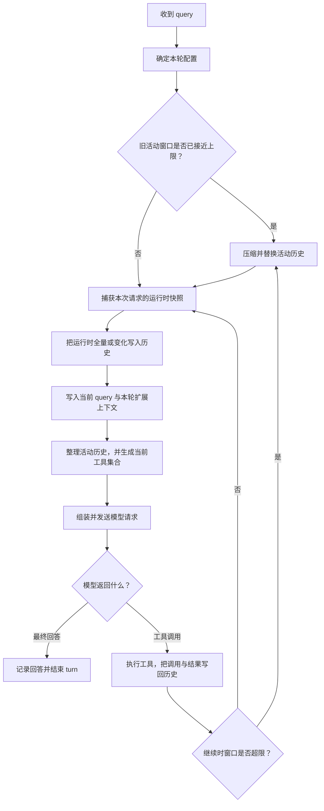

<section className="originalQuestionBox" aria-label="原始问题">
  
原始问题

  <blockquote>
    一次 query 后，Codex 如何构造模型上下文？
  </blockquote>
</section>

## 先给出完整答案

一次 query 到达后，Codex **不会围绕这句话重新搜索一批“相关上下文”**，也不会把所有内容临时拼成一条大字符串。它维护的是一条有顺序的**活动历史**。新 query 会被写入这条历史；在真正调用模型前，Codex 再补入当前运行环境的变化，整理历史中不合法或模型不支持的内容，并把以下几部分一起组装成请求：

| 请求组成 | 模型实际得到什么 |
| --- | --- |
| 基础指令 | 当前模型的基础行为约束 |
| 活动历史 | 旧对话、当前 query、运行时上下文、模型输出、工具调用及结果 |
| 工具定义 | 这一次请求真正可以调用的工具及参数结构 |
| 请求控制 | 模型、推理配置、输出 schema、缓存键等协议参数 |

如果模型调用了工具，Codex 会把工具调用和执行结果继续追加到活动历史，然后重新构造下一次模型请求。因此，“一次 query 后构造上下文”不是一个瞬间完成的拼接动作，而是一个循环：

下面按这条时间线解释每一步如何生效。

## 第一步：query 先进入 turn

客户端提交 `Op::UserInput`。它的核心是用户输入项，但也可以同时携带线程设置、IDE 提供的 additional context、最终输出 schema 和请求 metadata。

处理入口会先应用这次提交带来的线程设置，然后尝试把输入交给当前正在运行的 turn：

- 如果没有 active turn，Codex 创建新的 `RegularTask`，由它进入 `run_turn`；
- 如果模型仍在处理上一段工作，新输入可以成为 steer / pending input，在后续允许的边界并入同一个 turn；
- additional context 会先与上次客户端状态比较，只把新增或改变的部分转成输入项。

这里形成了第一个重要边界：**query 属于 turn，而不是直接属于某一次 HTTP 请求。** 一个 turn 可能因为工具调用、重试或中途追加输入而产生多次模型请求。

源码依据：

- `codex-rs/protocol/src/protocol.rs::Op::UserInput`
- `codex-rs/core/src/session/handlers.rs::user_input_or_turn_inner`
- `codex-rs/core/src/tasks/regular.rs::RegularTask::run`

## 第二步：在写入 query 前，先判断旧窗口是否需要压缩

`run_turn` 开始时先执行 pre-sampling compaction 检查。这个时点很关键：它发生在本轮运行时更新和新 query 写入活动历史之前。

如果旧历史已经逼近上下文上限，Codex 会先把旧窗口压缩成新的活动历史，再承接当前 query。这样做避免刚把新输入写进去，第一次模型请求就因为窗口过大而失败。

如果无需压缩，则沿用当前活动历史。所谓“沿用”不是重新从 rollout 文件抓取内容，而是继续使用会话状态里的 `ContextManager`；其中的 item 按从旧到新的顺序保存。

源码依据：

- `codex-rs/core/src/session/turn.rs::run_turn`
- `codex-rs/core/src/context_manager/history.rs::ContextManager`

## 第三步：为这一次模型调用固定运行现场

进入第一次 sampling 前，Codex 调用 `capture_step_context`。它会为这一次请求固定一份一致的运行时快照，包括当前 turn 配置、环境、实际生效的 `AGENTS.md`、MCP runtime、MCP 工具和 capability 状态。

为什么不能只在 turn 开始时取一次？因为一个 turn 可能包含多次模型调用。在工具执行后，文件、权限、MCP 能力或其他运行状态可能已经变化。下一次 sampling 需要看到新状态，但同一次 sampling 内又不能出现“模型看到工具 A，执行时却切到工具 B”的撕裂。

因此源码中的作用域是：

| 作用域 | 保持多久 | 负责什么 |
| --- | --- | --- |
| turn | 从用户任务开始到最终回复结束 | 固定本轮模型、cwd、权限、输出格式等控制配置 |
| step / sampling | 只对应一次模型调用 | 固定这次调用看到并实际使用的环境与工具快照 |

这一步还没有发送请求。它只是确定：**接下来写入模型上下文的运行状态，与接下来真正可调用的工具，必须来自同一份现场。**

源码依据：

- `codex-rs/core/src/session/mod.rs::capture_step_context`
- `codex-rs/core/src/session/step_context.rs::StepContext`

## 第四步：把当前运行状态写入活动历史

有了现场快照，Codex 会构造当前 `WorldState`。它描述的不是用户聊天内容，而是模型完成任务必须知道的运行条件，例如：

- 当前工作目录、workspace roots、日期和时区；
- 当前生效的 `AGENTS.md`；
- 文件系统、网络和审批权限；
- collaboration mode；
- apps、plugins、extensions 和其他环境能力。

这些状态不是每次都全量重复。`ContextManager` 维护上一份可信 baseline，实际规则是：

- **没有 baseline**：注入完整 initial context；
- **有 baseline 且状态未变**：不追加重复内容；
- **有 baseline 且状态变化**：只追加模型需要看到的变化；
- **历史替换或回退导致 baseline 不再可信**：重新注入完整上下文。

这套机制解决的不是“哪些状态与 query 语义相关”，而是“模型是否已经见过某个仍然有效的状态”。例如 cwd 没变就不必重复；权限发生变化则必须告诉模型。

这些 full/diff 内容会被真正记录成对话 item，进入后续请求使用的活动历史。baseline 只是决定本次追加全量还是差量，并不是一份游离在 history 之外的隐藏 prompt。

源码依据：

- `codex-rs/core/src/session/world_state.rs::build_world_state_for_step`
- `codex-rs/core/src/session/mod.rs::record_context_updates_and_set_reference_context_item`
- `codex-rs/core/src/context_manager/updates.rs`

## 第五步：记录当前 query 和本轮专属上下文

运行时更新之后，Codex 才处理本轮输入。常见顺序可以理解为：

1. 旧活动历史已经存在；
2. 当前运行状态的 full 或 diff 被追加进去；
3. additional context 与当前 user message 被记录；
4. hooks、显式 mention 的 skill / plugin / app，以及 turn extension 贡献必要的附加项。

所有这些内容最终都通过 `record_conversation_items` 进入同一个 `ContextManager`。记录动作还会同步完成几件事：为 item 绑定 turn id、按策略截断过长工具输出、持久化到 rollout，并向客户端发送对应事件。

因此到了 sampling 阶段，当前 query 已经不是一个单独等待拼接的字段，而是活动历史中最新的一条 user message。它之前有旧对话和当前运行状态，之后可能还有本轮明确触发的能力说明。

源码依据：

- `codex-rs/core/src/session/turn.rs::run_hooks_and_record_inputs`
- `codex-rs/core/src/session/turn.rs::build_skills_and_plugins`
- `codex-rs/core/src/session/mod.rs::record_conversation_items`

## 第六步：在发送前，把活动历史物化成模型输入

准备 sampling 时，`run_turn` 克隆当前 `ContextManager`，再调用 `for_prompt`。这不是一次语义检索，而是一次协议整理：

- 保证工具调用与工具结果成对；
- 移除没有对应调用的孤立结果；
- 根据当前模型能力去掉不支持的图片或音频；
- 使用写入时已经执行过截断的工具输出。

随后，Codex 从同一个 step snapshot 构造 `ToolRouter`，取得这次真正对模型可见的工具定义，再把模型输入、工具、基础指令、并行工具调用开关和输出 schema 组装成 Core 层的 `Prompt`。

最后，`ModelClient` 把这个 `Prompt` 转换成 Responses API 请求，并加入 model、reasoning、verbosity、service tier、prompt cache key 和 metadata 等传输参数。

所以模型最终接收的并不是“历史文本 + query”这么简单，而是：

> 一份经过规范化的活动历史，加上与这份历史所描述现场一致的工具能力，再加上本轮的模型与输出控制。

源码依据：

- `codex-rs/core/src/context_manager/history.rs::ContextManager::for_prompt`
- `codex-rs/core/src/session/turn.rs::run_sampling_request`
- `codex-rs/core/src/session/turn.rs::build_prompt`
- `codex-rs/core/src/client.rs::ModelClient::build_responses_request`

## 第七步：工具结果写回历史，整个链路再走一遍

模型返回普通 assistant message 时，Codex 记录它并结束 turn。模型返回工具调用时，链路不会结束：

1. 先把模型产生的 tool call 记录进活动历史；
2. 使用本次 step 对应的 runtime 执行工具；
3. 把 tool output 记录到活动历史；
4. 判断是否还有 pending input，以及窗口是否达到压缩阈值；
5. 如需继续，重新捕获 step、更新运行状态、整理完整活动历史并构造下一次请求。

第二次请求因此天然包含第一次请求的逻辑输入，再加上模型刚才的调用和工具结果。它不是只把“新增结果”单独发给模型；即使底层传输可能利用缓存或增量协议，Core 层构造的仍是当下完整、有效的请求视图。

这就是同一个 query 能驱动多次上下文构造的原因，也是 agent 能连续行动的核心闭环：

> 模型输出进入历史 → 工具产生事实 → 事实进入历史 → 模型基于新历史继续决策。

源码依据：

- `codex-rs/core/src/session/turn.rs::try_run_sampling_request`
- `codex-rs/core/src/stream_events_utils.rs::record_completed_response_item`
- `codex-rs/core/src/session/turn.rs::drain_in_flight`

## 第八步：历史装不下时，替换活动窗口

如果工具循环仍需继续，但 token 状态已经达到限制，Codex 会执行 mid-turn compaction。它让模型总结旧过程，然后构造一份 replacement history，主要保留：

- 预算允许范围内的近期真实用户消息；
- 对旧过程的任务交接摘要；
- 继续当前 turn 所需的 initial context。

随后 `replace_compacted_history` 直接把 `ContextManager` 的活动内容换成这份新历史，并重建相应 baseline、推进 window id、重新计算 token usage。下一次 sampling 仍走前面相同的构造流程，只是它读取的“连续历史”已经从旧窗口切换到了压缩后的新窗口。

因此压缩不是给完整历史再附加一段摘要，而是改变后续模型请求的上下文来源。完整 rollout 可以继续用于持久化和恢复，但它不再等于当前模型每次都能看到的活动窗口。

源码依据：

- `codex-rs/core/src/compact.rs::run_compact_task_inner_impl`
- `codex-rs/core/src/session/mod.rs::replace_compacted_history`

缓存命中、增量传输与活动窗口替换之间的关系，见[缓存命中和压缩如何协作](./prompt-cache-compaction)。

## 那么，Codex 如何判断哪些上下文与当前 query 有关？

这里最容易产生误解。正常 turn 链路里并不存在一个通用的“用当前 query 对旧对话做向量检索，再取 top-k”步骤。不同上下文采用的是不同选择机制：

| 上下文来源 | Codex 的选择依据 |
| --- | --- |
| 历史对话 | 是否仍在当前活动窗口，而不是与 query 的语义相似度 |
| 运行时状态 | 作用域是否生效、相对 baseline 是否变化 |
| skill / plugin / app | 显式 mention、配置与扩展规则 |
| 图片和音频 | 当前模型是否支持对应输入模态 |
| 工具输出 | 截断策略与工具调用配对关系 |
| 压缩后的旧信息 | compaction 摘要与近期用户消息保留策略 |

换句话说，Codex Core 负责的是**来源、顺序、作用域、一致性和窗口边界**。旧历史中的哪句话对当前 query 最有帮助，通常由模型在看到活动窗口后判断，而不是 Core 在请求前做统一的语义筛选。

## 正确的心智模型

一次 query 后，Codex 构造模型上下文的完整链路可以归纳为五句话：

1. query 先加入一个 turn，而不是直接变成一次 API 请求。
2. 每次 sampling 前，Codex 固定一份一致的运行时与工具快照。
3. 运行状态的全量或变化、当前 query 和扩展内容被依次写入活动历史。
4. 活动历史经过协议整理后，与基础指令和当前工具集合一起物化为模型请求。
5. 工具调用和结果继续写回历史，驱动下一次构造；窗口过长时则用压缩后的历史接力。

因此，Codex 的模型上下文既不是临时搜集的一包资料，也不是永远增长的完整聊天记录。它是一个**持续记录、逐次物化、必要时换窗**的活动状态：连续性由 history 保证，实时性由 step snapshot 和 world-state diff 保证，长度边界由 compaction 保证。

---

> 源码快照：本章基于 `openai/codex@841e47b8fb` 核对；文中路径均为仓库相对路径。
