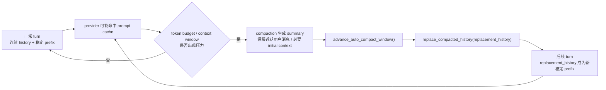

<section className="originalQuestionBox" aria-label="原始问题">
  <div className="originalQuestionLabel">原始问题</div>
  <blockquote>
    缓存命中和压缩是如何协作的？我们的历史对话有缓存命中，它包含完整的历史。但如果我们要压缩历史对话的上下文，是否意味着需要抛弃缓存命中，换成这些压缩后的上下文？它是如何做到精准识别缓存命中，将这些缓存命中替换成压缩后的上下文？
  </blockquote>
</section>

## 先回答

这里有一个需要修正的前提：Codex 不是先“精准识别哪些历史片段已经缓存命中”，再把这些片段替换成压缩后的上下文。源码里更接近真实实现的模型是：



所以“缓存命中”和“压缩”的协作不是片段级替换，而是**窗口级接力**：旧窗口尽量吃到稳定前缀带来的缓存收益；当上下文窗口健康比缓存收益更重要时，Codex 接受旧 prefix 被改写，然后把压缩后的历史安装成新窗口，让它从后续 turn 开始重新积累缓存友好性。

## 两个层级不要混在一起

| 层级 | Codex 看到什么 | Codex 用它做什么 |
| --- | --- | --- |
| provider prompt cache | 服务端返回的 token usage，例如 `cached_input_tokens`、`cache_write_input_tokens` | 记录预算和 analytics，反映这次请求有多少输入被缓存 |
| 本地 context window | `ContextManager` 里的 history、world-state baseline、turn context baseline、auto-compact window metadata | 决定什么时候压缩、压缩后安装什么 replacement history |

用户问题里“精准识别缓存命中，将这些缓存命中替换成压缩后的上下文”把这两层合成了一个算法。但从当前源码看，Codex 没有把 provider 返回的 cache hit 明细当成 compaction planner 的输入。它拿到的是汇总 token usage，不是“第 12 到第 18 条历史命中了缓存”这种可编辑区间。

下文源码均为删节片段：保留能支撑判断的状态字段和关键调用，省略 import、错误处理、长字段列表和与本问题无关的包装代码。

## 1. 压缩触发看 token window，不看 cache hit

出处：`codex-rs/core/src/session/context_window.rs::context_window_token_status`

```rust
let active_context_tokens = sess.get_total_token_usage().await;

let (auto_compact_scope_tokens, auto_compact_scope_limit, auto_compact_window_prefill_tokens) =
    match turn_context.config.model_auto_compact_token_limit_scope {
        AutoCompactTokenLimitScope::Total => (
            active_context_tokens,
            turn_context.model_info.auto_compact_token_limit(),
            None,
        ),
        AutoCompactTokenLimitScope::BodyAfterPrefix => {
            let window = sess.auto_compact_window_snapshot().await;
            let baseline = window.prefill_input_tokens.unwrap_or(active_context_tokens);
            (
                active_context_tokens.saturating_sub(baseline),
                scope_limit,
                window.prefill_input_tokens,
            )
        }
    };

let token_limit_reached = buffered_auto_compact_limit
    .is_some_and(|limit| auto_compact_scope_tokens >= limit)
    || full_context_window_limit_reached;
```

这段代码里没有 cache hit 参与决策。`BodyAfterPrefix` 也不是“保留 provider cache”的机制，它只是换了 token budget 的计算口径：如果当前窗口有一段 prefill prefix，就只把 prefix 之后增长出来的 body 算进 auto-compact scope。完整上下文窗口仍然是硬上限。

更准确地说，`BodyAfterPrefix` 保护的是“不要因为稳定前缀本身太大而过早触发压缩”，不是“旧缓存一定继续有效”。

## 2. cache usage 被记录，但不是压缩规划器

出处：`codex-rs/core/src/compact_remote_v2.rs`

```rust
if let Some(token_usage) = token_usage {
    sess.record_rollout_budget_usage(&token_usage)?;
    analytics_details.active_context_tokens_before = Some(token_usage.input_tokens);
    analytics_details.compaction_summary_tokens = Some(token_usage.output_tokens);
    analytics_details.cached_input_tokens = Some(token_usage.cached_input_tokens);
    analytics_details.cache_write_input_tokens = Some(token_usage.cache_write_input_tokens);
}
```

这段说明 remote compaction 会把 `cached_input_tokens` 和 `cache_write_input_tokens` 记录下来。但它们进入的是 rollout budget / analytics details。后面的安装流程仍然是构造 `new_history`、推进 window、替换 history；没有出现“根据 cached token 区间选择保留或替换历史片段”的逻辑。

这个证据的意义在于：Codex 能观测缓存收益，但当前架构没有把 prompt cache 暴露成可精确编辑的历史结构。prompt cache 是 provider 对请求前缀的服务端优化；compaction 是 Codex 对本地模型上下文窗口的结构化维护。

## 3. compaction 请求里有 cache-aware 的小策略，但边界很窄

出处：`codex-rs/core/src/compact.rs::run_compact_task_inner_impl`

```rust
let mut history = sess.clone_history().await;
history.record_items(
    &[initial_input_for_turn.into()],
    turn_context.model_info.truncation_policy.into(),
);

loop {
    let turn_input = history
        .clone()
        .for_prompt(&turn_context.model_info.input_modalities);
    let turn_input_len = turn_input.len();

    let attempt_result = drain_to_completed(..., &prompt).await;

    match attempt_result {
        Err(e @ CodexErr::ContextWindowExceeded) => {
            if turn_input_len > 1 {
                // Trim from the beginning to preserve cache (prefix-based) and keep recent messages intact.
                history.remove_first_item();
                retries = 0;
                continue;
            }
            return Err(e);
        }
        ...
    }
}
```

这段容易被误读。它确实提到 “preserve cache (prefix-based)”，但它发生在**生成摘要的临时 compaction 请求**里：如果摘要请求本身超窗，就删掉最老的历史项，保留后面较新的内容继续尝试。

它不是在安装压缩结果时对旧会话历史做“缓存命中片段替换”。这个策略只说明 Codex 知道 cache 是 prefix-based，并在 compaction 采样失败重试时尽量不破坏剩余请求形态；它不改变 compaction 的窗口级 replacement 模型。

## 4. 压缩结果会变成新的 replacement history

出处：`codex-rs/core/src/compact.rs::run_compact_task_inner_impl`

```rust
let history_snapshot = sess.clone_history().await;
let history_items = history_snapshot.raw_items();
let summary_suffix = get_last_assistant_message_from_turn(history_items).unwrap_or_default();
let summary_text = format!("{SUMMARY_PREFIX}\n{summary_suffix}");
let user_messages = collect_user_messages(history_items);

let mut new_history = build_compacted_history(Vec::new(), &user_messages, &summary_text);

let (window_number, window_ids) = sess.advance_auto_compact_window().await;

let (initial_context, world_state_baseline) = build_compaction_initial_context(...).await;
if !initial_context.is_empty() {
    new_history =
        insert_initial_context_before_last_real_user_or_summary(new_history, initial_context);
}

let compacted_item = CompactedItem {
    message: summary_text.clone(),
    replacement_history: Some(new_history.clone()),
    window_number: Some(window_number),
    first_window_id: Some(window_ids.first_window_id.to_string()),
    previous_window_id: window_ids.previous_window_id.map(|id| id.to_string()),
    window_id: Some(window_ids.window_id.to_string()),
};

sess.replace_compacted_history(..., new_history, ..., compacted_item).await;
sess.recompute_token_usage(&turn_context).await;
```

这个片段给出了真正的边界：compaction 完成后，Codex 推进 `auto_compact_window`，生成新的 `window_id`，再把 `new_history` 安装进去。这里的关键对象是 `replacement_history`，不是 cache hit segments。

## 5. replacement history 的主体是近期用户消息加摘要

出处：`codex-rs/core/src/compact.rs::build_compacted_history_with_limit`

```rust
let mut selected_messages: Vec<CompactedUserMessage> = Vec::new();
let mut remaining = max_tokens;
for message in user_messages.iter().rev() {
    if remaining == 0 {
        break;
    }
    let tokens = approx_token_count(&message.message);
    if tokens <= remaining {
        selected_messages.push(message.clone());
        remaining = remaining.saturating_sub(tokens);
    } else {
        let truncated = truncate_text(&message.message, TruncationPolicy::Tokens(remaining));
        selected_messages.push(CompactedUserMessage {
            message: truncated,
            internal_chat_message_metadata_passthrough: message
                .internal_chat_message_metadata_passthrough
                .clone(),
        });
        break;
    }
}
selected_messages.reverse();

for message in &selected_messages {
    history.push(ResponseItem::Message {
        role: "user".to_string(),
        content: vec![ContentItem::InputText {
            text: message.message.clone(),
        }],
        ...
    });
}

history.push(ResponseItem::Message {
    role: "user".to_string(),
    content: vec![ContentItem::InputText { text: summary_text }],
    ...
});
```

这段能解释“换成这些压缩后的上下文”到底是什么意思：Codex 不是把完整历史压成一个单独摘要就结束，而是把预算内的近期用户消息保留下来，再追加 summary。这样做的取舍是保留最近的用户意图和 metadata，同时用摘要承载更早的对话状态。

这也解释了一个风险：压缩后不再是完整原始历史。模型后续看到的是 replacement history，它更短、更可控，但长期准确性依赖 summary 质量和近期消息选择。

## 6. 安装阶段是整体替换，并重新建立 baseline

出处：`codex-rs/core/src/session/mod.rs::replace_compacted_history`

```rust
let compacted_item = CompactedItem {
    replacement_history: Some(items.clone()),
    ..compacted_item
};

{
    let mut state = self.state.lock().await;
    state.replace_history(items, reference_context_item.clone());
    if let Some(world_state) = world_state_baseline {
        let snapshot = world_state.snapshot();
        world_state_item = Some(WorldStateItem::full(snapshot.clone().into_value()));
        state.history.set_world_state_baseline(snapshot);
    }
}

self.persist_rollout_items(&[RolloutItem::Compacted(compacted_item)])
    .await;
if let Some(world_state_item) = world_state_item {
    self.persist_rollout_items(&[RolloutItem::WorldState(world_state_item)])
        .await;
}
if let Some(turn_context_item) = reference_context_item {
    self.persist_rollout_items(&[RolloutItem::TurnContext(turn_context_item)])
        .await;
}
```

这段是本章最关键的证据：`state.replace_history(...)` 是整体替换。替换后还会持久化 `CompactedItem`，必要时写入新的 `WorldState` baseline 和 `TurnContext` baseline。

所以 compaction 的语义不是“在旧历史里替换一些缓存命中的片段”，而是“关闭旧的模型上下文窗口，安装一个可以恢复、回放、继续增长的新窗口”。

## 7. 新窗口也可能完全不带摘要

出处：`codex-rs/core/src/session/mod.rs::start_new_context_window`

```rust
let (window_number, window_ids) = {
    let mut state = self.state.lock().await;
    state.start_new_context_window()
};
let context_items = self
    .build_initial_context_with_world_state(turn_context, world_state.as_ref())
    .await;
let turn_context_item = turn_context.to_turn_context_item();
self.replace_compacted_history(
    turn_context,
    context_items,
    Some(turn_context_item),
    Some(world_state),
    CompactedItem {
        message: String::new(),
        replacement_history: None,
        window_number: Some(window_number),
        first_window_id: Some(window_ids.first_window_id.to_string()),
        previous_window_id: window_ids.previous_window_id.map(|id| id.to_string()),
        window_id: Some(window_ids.window_id.to_string()),
    },
)
.await;
```

这说明 Codex 的“窗口级接力”不只服务于摘要压缩。有时它会直接开启新 context window，只安装 initial context 和 world state。这里更能看清架构边界：窗口是 Codex 的本地上下文生命周期单位；provider cache 是请求侧优化，不是这个生命周期的主键。

## 协作模型

| 阶段 | cache 的角色 | compaction 的角色 | 真实取舍 |
| --- | --- | --- | --- |
| 稳态对话 | 稳定 prefix 更容易命中 provider prompt cache | 不介入或只做预算监控 | 优先利用连续 history 的缓存收益 |
| token 压力上升 | cache hit 不能解决窗口硬上限 | 根据 token status 触发压缩或新窗口 | 窗口健康优先于旧 prefix 复用 |
| 压缩采样 | 临时请求重试时尽量保留 prefix 形态 | 生成 summary / compacted output | 这是 compaction 请求内部策略，不是旧历史手术 |
| 安装结果 | 旧 prefix 的缓存收益可能下降 | 整体替换 history，持久化 replacement | 接受一次 cache discontinuity，换来可继续运行 |
| 后续 turn | 新 replacement history 逐渐成为稳定 prefix | 新窗口继续累计 token usage 和 baseline | cache 重新从新窗口开始积累 |

## 本章结论

你的问题里“是否意味着需要抛弃缓存命中”可以回答为：**压缩发生的那一刻，旧完整历史作为 prompt prefix 的缓存价值很可能会下降；但 Codex 不是把 cache hit 精准替换成 summary，而是切换到一个新的上下文窗口。**

这不是缓存和压缩互相排斥，而是两者工作在不同层级：缓存优化正常请求的稳定前缀，压缩维护长期会话的上下文可持续性。Codex 的选择是把协作边界放在 window 上，而不是放在 token span 上。这个选择降低了实现复杂度和恢复复杂度，但代价是 compaction 边界处无法保证旧 provider cache 的连续命中。
