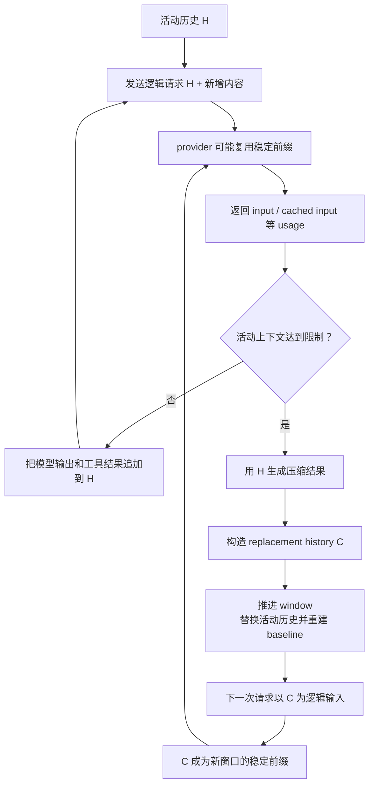

<section className="originalQuestionBox" aria-label="原始问题">
  <div className="originalQuestionLabel">原始问题</div>
  <blockquote>
    缓存命中和压缩是如何协作的？我们的历史对话有缓存命中，它包含完整的历史。但如果我们要压缩历史对话的上下文，是否意味着需要抛弃缓存命中，换成这些压缩后的上下文？它是如何做到精准识别缓存命中，将这些缓存命中替换成压缩后的上下文？
  </blockquote>
</section>

## 先说结论

这个问题里最需要纠正的是：“缓存中保存着一份完整历史，Codex 压缩时要找到并替换它。”源码里没有这样的过程。

Codex 真正维护的是**活动历史**。provider prompt cache 只是模型服务端对重复输入的计算优化，不是 Codex 的历史数据库。压缩发生时，Codex 替换的是本地活动历史；它既不知道 provider 缓存了哪些具体消息，也不会去修改 provider 的缓存条目。

完整链路是：

1. 正常对话不断在活动历史末尾追加内容，稳定前缀因而容易获得缓存收益。
2. 缓存命中的 token 仍占据上下文窗口；窗口达到限制时，Codex 仍然必须压缩。
3. compaction 根据旧历史生成一份更短的 replacement history。
4. Codex 推进 context window，并整体安装 replacement history 和与之匹配的状态 baseline。
5. 下一次模型调用以新历史为准；旧完整历史不再作为模型输入。
6. 新历史继续增长，逐渐形成新的稳定前缀。

所以缓存和压缩不是“同一份历史上的局部替换”，而是**两个不同层级的接力**：缓存尽量降低当前窗口的重复计算，压缩负责在窗口装不下时建立一个新的可持续窗口。



## 首先分清四个对象

“历史”“缓存”“窗口”和“增量请求”经常被混在一起，但它们不是同一个东西。

| 对象 | 所在位置 | 是否决定模型看到什么 | 生命周期 |
| --- | --- | --- | --- |
| `ContextManager` 活动历史 | Codex Core | 是 | 当前 context window |
| rollout | Codex 持久化层 | 不直接决定下一次 prompt | 整个线程，可用于恢复和回放 |
| provider prompt cache | 模型服务端 | 否，只优化相同输入的计算 | 由 provider 管理 |
| WebSocket 增量状态 | turn 内的 `ModelClientSession` | 否，只优化发送方式 | 当前 turn |

这张表直接回答了原问题的一半：**Codex 压缩的是活动历史，不是 rollout，也不是 provider cache。**

旧消息此前已经写入 rollout，因此换窗不等于删除会话档案。但下一次 sampling 从 `ContextManager` 读取活动历史，所以模型看到的会变成压缩后的新窗口。

## 正常阶段为什么容易命中缓存？

每次 sampling 前，Codex 都会从当前活动历史构造完整的逻辑请求。`ModelClient::build_responses_request` 还会加入 `prompt_cache_key`；默认情况下，这个 key 来自 `responses_metadata.session_id`，同一 session 因而使用稳定的缓存路由标识。

在没有压缩时，请求通常这样增长：

| 请求 | 逻辑输入 |
| --- | --- |
| 第一次 | `H + query` |
| 工具调用后 | `H + query + tool call + tool output` |
| 下一轮对话 | 上一份历史再追加新的 user message |

旧内容保持在开头，新内容追加在末尾，provider 因而有机会复用稳定前缀的计算。

但 Codex 只能从 response usage 中看到几个汇总数字：`input_tokens`、`cached_input_tokens` 和 `cache_write_input_tokens`。协议没有返回“哪些消息”或“哪一段 token”命中了缓存。

这意味着：

- Codex 可以统计这次缓存了多少 token；
- Codex 无法把缓存命中映射回某几条历史消息；
- compaction planner 也没有可供编辑的“缓存片段列表”。

因此，原问题中“精准识别缓存命中并替换”的步骤并不存在。

源码依据：

- `codex-rs/core/src/client.rs::ModelClient::prompt_cache_key`
- `codex-rs/core/src/client.rs::ModelClient::build_responses_request`
- `codex-rs/codex-api/src/sse/responses.rs::ResponseCompletedUsage`

## 缓存命中为什么不能阻止压缩？

因为缓存优化的是计算，context window 限制的是模型这次能够承载的逻辑 token 数。一个 token 即使命中了缓存，仍然存在于模型输入中，也仍然占据上下文窗口。

Codex 检查压缩条件时，读取的是 `active_context_tokens`。配置可以选择计算全部活动 token，也可以选择只计算当前窗口初始 prefix 之后增长出来的 body；无论采用哪种口径，模型完整上下文窗口仍然是独立的硬上限。

下面这段删节源码保留了真正决定压缩的分支。注意其中没有 `cached_input_tokens`。

出处：`codex-rs/core/src/session/context_window.rs::context_window_token_status`

```rust
let active_context_tokens = sess.get_total_token_usage().await;

let (auto_compact_scope_tokens, auto_compact_scope_limit, auto_compact_window_prefill_tokens) =
    match turn_context.config.model_auto_compact_token_limit_scope {
        AutoCompactTokenLimitScope::Total => (
            active_context_tokens,
            turn_context.model_info.auto_compact_token_limit(),
            None,
        ),
        AutoCompactTokenLimitScope::BodyAfterPrefix => {
            let window = sess.auto_compact_window_snapshot().await;
            let baseline = window.prefill_input_tokens.unwrap_or(active_context_tokens);

            let scope_limit = turn_context
                .config
                .model_auto_compact_token_limit
                .or_else(|| turn_context.model_info.auto_compact_token_limit());
            (
                active_context_tokens.saturating_sub(baseline),
                scope_limit,
                window.prefill_input_tokens,
            )
        }
    };

let full_context_window_limit_reached =
    full_context_window_limit.is_some_and(|limit| active_context_tokens >= limit);
let token_limit_reached = buffered_auto_compact_limit
    .is_some_and(|limit| auto_compact_scope_tokens >= limit)
    || full_context_window_limit_reached;
```

这段代码里有一个很好的取舍：`BodyAfterPrefix` 允许一个较大的初始前缀不至于立刻耗尽“增长预算”，但它不能绕过完整窗口的硬上限。Codex 可以优化窗口何时滚动，却不会把“缓存过的 token”误当成“不占空间的 token”。

更重要的是，compaction 生命周期不依赖 provider 缓存是否恰好存在。否则同一份活动历史可能仅仅因为服务端缓存过期，就改变压缩时机和模型后续看到的内容。

源码依据：

- `codex-rs/core/src/session/turn.rs::run_pre_sampling_compact`
- `codex-rs/core/src/session/turn.rs::run_auto_compact`
- `codex-rs/core/src/state/auto_compact_window.rs::AutoCompactWindow`

## compaction 到底生成了什么？

当前代码包含本地压缩、remote compaction 和 remote compaction v2 等路径。它们生成压缩结果的方式不同，但最后都必须产出一份可以安装为活动历史的 `new_history`。

以本地压缩为例：

1. Codex 用当前活动历史发起一次专门的 compaction sampling；
2. 模型为旧过程生成任务交接摘要；
3. Codex 从原历史中按预算保留近期真实用户消息；
4. 近期用户消息与摘要共同组成 `new_history`；
5. 如果当前 turn 还要继续，Codex 把当前 initial context 插到最后一条真实用户消息或摘要之前。

保留近期用户消息而不只保留摘要，是为了让最近的用户意图和消息 metadata 尽量保持原样；更早的操作过程则交给摘要承载。这不是无损压缩：它用可继续性和更短窗口，交换了旧细节的完整保真。

这里还有一个容易忽略的细节。compaction 本身也是一次模型请求，因此它可能从旧稳定前缀获得缓存收益。但这只是降低“生成摘要”这次请求的成本；返回的 cached token 数不会参与 `new_history` 的选择。

源码依据：

- `codex-rs/core/src/compact.rs::run_compact_task_inner_impl`
- `codex-rs/core/src/compact.rs::build_compacted_history`
- `codex-rs/core/src/compact_remote.rs`
- `codex-rs/core/src/compact_remote_v2.rs`

## 压缩结果如何真正接管后续请求？

生成 `new_history` 还不算完成。Codex 接下来会推进 auto-compact window，生成新的 window id，再调用 `replace_compacted_history` 安装结果并重新估算 token usage。

安装函数中的这段源码必须直接保留，因为它定义了“替换”的真实含义。

出处：`codex-rs/core/src/session/mod.rs::replace_compacted_history`

```rust
let compacted_item = CompactedItem {
    replacement_history: Some(items.clone()),
    ..compacted_item
};

{
    let mut state = self.state.lock().await;
    state.replace_history(items, reference_context_item.clone());
    if let Some(world_state) = world_state_baseline {
        let snapshot = world_state.snapshot();
        world_state_item = Some(WorldStateItem::full(snapshot.clone().into_value()));
        state.history.set_world_state_baseline(snapshot);
    }
}

self.persist_rollout_items(&[RolloutItem::Compacted(compacted_item)]).await;
```

这段代码同时完成三件事：

1. `state.replace_history(...)` 让后续 sampling 改用新活动历史；
2. 新窗口从完整 world-state snapshot 建立 baseline，避免后续只收到失去前态的 diff；
3. 同一份 replacement history 被持久化进 `CompactedItem`，让 resume 和 rollout reconstruction 能恢复相同窗口。

精妙之处不在“调用了 replace”，而在**模型输入、运行时 baseline 和持久化恢复点一起换窗**。如果只替换历史而不重建 baseline，模型可能看到不完整的运行环境；如果只改内存而不持久化，恢复后的会话又会走向另一条历史。

换窗完成后，完整旧 rollout 仍然存在，但后续 `ContextManager::for_prompt` 读取的是 replacement history。这里没有在旧历史中逐项寻找 cached message，也没有把 summary 写回 provider cache。

## 换窗后，旧缓存如何过渡到新请求？

从 Codex 源码能确定的是：

- 新活动历史成为下一次请求的逻辑 input；
- 默认 `prompt_cache_key` 仍然来自同一 session，不会因为 window id 变化自动换 key；
- Codex 不持有 provider 缓存条目句柄，也没有删除旧缓存的调用。

因此，Codex 没有“先抛弃旧缓存，再写入新缓存”的显式步骤。它只是提交一份内容已经变化的新逻辑请求。provider 内部究竟还能复用多少公共前缀，Codex 源码无法保证；可以确定的是，包含完整旧历史的那段输入已经不再由 Codex 提交。随后请求继续在 replacement history 后追加内容，新窗口便重新形成稳定前缀。

这里还需要区分 WebSocket 增量传输。它不是 prompt cache，但它确实负责判断“这次能否只发送新增 item”。判断条件非常严格：非 input 请求属性必须相同，而且“上次请求 + 上次模型响应”必须与本次 input 的开头逐项相等。

出处：`codex-rs/core/src/client.rs::ModelClientSession::get_incremental_items`

```rust
if !responses_request_properties_match(previous_request, request) {
    return None;
}

let Some((request_items_to_compare, incremental_items)) =
    request.input.split_at_checked(previous_items.len())
else {
    return None;
};
let mut request_prefix = request_items_to_compare.to_vec();
request_prefix
    .iter_mut()
    .for_each(ResponseItem::clear_internal_chat_message_metadata_passthrough);

if previous_items != request_prefix {
    return None;
}

Some(incremental_items.to_vec())
```

压缩后的 replacement history 通常不是旧 input 的严格追加，因此这项检查无法通过。`None` 的含义是“不使用 delta”，客户端随后发送完整新请求。

这才是源码里存在的“精准识别”，但它识别的是**请求连续性**，不是缓存命中位置。只有能够证明两次请求语义连续，Codex 才允许省略旧前缀；证明不了就回退完整请求。即使传输优化失效，模型上下文仍然正确。

## 这套协作方式好在哪里？

它最大的优点是把正确性机制与性能机制分开了。

| 设计 | 解决的问题 | 具体收益 | 代价 |
| --- | --- | --- | --- |
| 活动历史独立于 provider cache | 模型下一次应该看到什么 | 缓存过期不会改变逻辑上下文 | 无法根据缓存内部布局精细压缩 |
| 压缩由 token/window 触发 | 上下文能否继续装下 | 生命周期稳定，不受缓存命中波动影响 | 命中率再高，窗口满了仍要压缩 |
| replacement history 整体安装 | 新窗口如何接管后续 sampling | 历史、baseline、恢复点保持一致 | 旧历史细节依赖摘要保真 |
| 增量请求要求严格前缀相等 | 什么时候可以省略旧 input | 不会把改写后的历史错误挂到旧 response 上 | 换窗后通常需要发送完整请求 |
| session 级 cache key 保持稳定 | 新旧请求如何保持缓存路由关联 | 新窗口可以重新积累稳定前缀 | 无法保证换窗边界仍命中多少旧缓存 |

这里的优秀之处不是“最大化缓存命中率”，而是明确了优化的服从关系：

1. 活动历史定义正确语义；
2. compaction 保证语义能继续装进窗口；
3. prompt cache 和 WebSocket delta 只在不改变语义时节省计算或传输。

当三者发生冲突时，Codex 宁可承受一次缓存连续性下降和完整请求，也不会让性能优化决定模型看到一份错误历史。

## 回到原始问题

**缓存命中和压缩如何协作？**

稳定增长的活动历史为 prompt cache 提供可复用前缀；窗口达到限制后，compaction 用更短的 replacement history 接管后续请求；新窗口继续增长，再形成新的稳定前缀。

**压缩是否意味着需要抛弃缓存命中？**

它会改变包含旧完整历史的输入前缀，因此不能保证延续原来的全部缓存收益。但 Codex 没有主动删除 provider 缓存，只是把上下文正确性置于旧前缀复用之上。

**Codex 是否把缓存中的完整历史替换成压缩上下文？**

不是。它替换的是 `ContextManager` 中的活动历史。provider cache 不是 Codex 的历史存储，rollout 也不会因为换窗而被整体删除。

**它如何精准识别缓存命中并进行替换？**

没有这个步骤。provider 只返回缓存 token 汇总，没有命中区间。源码中的精确前缀比较属于 WebSocket 增量传输：一旦 replacement history 不再是旧请求的严格延续，就回退发送完整新请求。

最准确的心智模型是：**prompt cache 让当前窗口重复计算得更少，compaction 让长期会话在窗口装满后还能继续；两者不共同编辑缓存，而是在 context window 边界上完成接力。**

---

> 源码快照：本章基于 `openai/codex@841e47b8fb` 核对；文中路径均为仓库相对路径。
