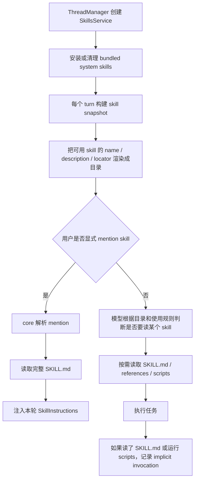

<section className="originalQuestionBox" aria-label="原始问题">
  <div className="originalQuestionLabel">原始问题</div>
  <blockquote>
    codex的skill机制是怎么样的，比如在codex启动时是不是就会加载skill，每次query如果用户没有主动提及skill，codex会自动搜索吗？如何判断本次query应该使用什么skill？使用几个skill？是用怎样的链路调用skill？怎么体现渐进式披露？如果用户对话提及skill，又是怎样一个流程？skill是否会近实时更新？比如用户在一个对话中途修改了skill，codex是否可以实时感知并更新？
  </blockquote>
</section>

## 先回答

Codex 的 skill 机制不是“启动时把所有 `SKILL.md` 全量塞进 prompt”，也不是“每次 query 都由 core 自动搜索最相关 skill”。更准确的模型是：



这里有两个容易混淆的层级：

| 层级 | Codex 做什么 | 没有做什么 |
| --- | --- | --- |
| skill 目录层 | 发现 skill，读取 frontmatter / metadata，向模型展示 name、description、source locator | 不把所有 `SKILL.md` 正文一次性注入 |
| skill 使用层 | 显式 mention 时由 core 读取并注入；模型自己决定使用时按目录去读 | 不在 core 里对每次 query 做 skill 正文语义检索 |

所以，“如果用户没有主动提及 skill，Codex 是否自动搜索？”答案要拆开说：**core 不做全量语义搜索；模型会看到可用 skill 目录，并按目录描述和 developer 规则自行判断是否应该使用。**

## 架构张力

skill 机制要同时满足两个目标：

1. **让模型知道有哪些专门能力可用。** 如果完全不暴露目录，模型很难知道应该读哪个 `SKILL.md`。
2. **不能把所有 skill 正文塞进上下文。** skill 可能很多，正文还可能引用 `references/`、`scripts/`、`assets/`，全量注入会浪费上下文，还会把无关规则引入当前任务。

Codex 的取舍是“目录先行，正文按需”。这也是渐进式披露的核心：先给模型一个索引，等它决定使用某个 skill 后，再读取完整 `SKILL.md`，再根据 `SKILL.md` 的路由说明读取必要引用。

## 1. 启动时创建服务，但每轮拿的是 snapshot

`SkillsService` 是 skill 机制的宿主。它负责发现、缓存、失效和额外 skill roots。初始化时只处理 bundled system skills 的安装/清理；真正用于模型上下文的是后面按配置构建出来的 snapshot。

出处：`codex-rs/core-skills/src/service.rs::SkillsService`

```rust
/// Owns host skill discovery, immutable snapshots, cache invalidation, and extra roots.
pub struct SkillsService {
    codex_home: AbsolutePathBuf,
    restriction_product: Option<Product>,
    extra_roots: RwLock<Vec<AbsolutePathBuf>>,
    cache_by_cwd: RwLock<HashMap<AbsolutePathBuf, HostSkillsSnapshot>>,
    cache_by_config: RwLock<HashMap<ConfigSkillsCacheKey, HostSkillsSnapshot>>,
    root_scan_slots: Arc<Semaphore>,
}

pub fn new_with_restriction_product(
    codex_home: AbsolutePathBuf,
    bundled_skills_enabled: bool,
    restriction_product: Option<Product>,
) -> Self {
    let service = Self { ... };
    if !bundled_skills_enabled {
        uninstall_system_skills(&service.codex_home);
    } else if let Err(err) = install_system_skills(&service.codex_home) {
        tracing::error!("failed to install system skills: {err}");
    }
    service
}
```

这段说明“启动加载 skill”不能理解为“启动时把全部 skill 正文读进模型”。启动期只是创建服务，并按配置准备 system skills。可用 skill 目录来自 snapshot，而 snapshot 有缓存。

出处：`codex-rs/core-skills/src/service.rs::snapshot_for_config`

```rust
pub async fn snapshot_for_config(
    &self,
    input: &SkillsLoadInput,
    fs: Option<Arc<dyn ExecutorFileSystem>>,
) -> HostSkillsSnapshot {
    let roots = self.skill_roots_for_config(input, fs).await;
    let skill_config_rules = skill_config_rules_from_stack(&input.config_layer_stack);
    let cache_key = config_skills_cache_key(&roots, &skill_config_rules);
    if let Some(snapshot) = self.cached_snapshot_for_config(&cache_key) {
        return snapshot;
    }

    let snapshot = HostSkillsSnapshot::new(Arc::new(
        self.build_skill_outcome(input, roots, &skill_config_rules).await,
    ));
    self.cache_by_config.write().unwrap().insert(cache_key, snapshot.clone());
    snapshot
}
```

这里真正重要的是 cache key：它不是只按 cwd 缓存，而是按 roots 和 skill config rules 缓存，避免不同会话、角色、本地覆盖共享同一个错误目录。

## 2. turn 构建时拿 skill snapshot

每一轮 `TurnContext` 构建时，Codex 会先算 plugin 带来的 skill roots，再交给 `SkillsService` 生成 snapshot。

出处：`codex-rs/core/src/session/turn_context.rs::new_turn_context_from_configuration`

```rust
let plugins_input = per_turn_config.plugins_config_input();
let plugin_outcome = self.services.plugins_manager.plugins_for_config(&plugins_input).await;
let effective_skill_roots = plugin_outcome.effective_plugin_skill_roots();
let plugin_skill_snapshots = self
    .services
    .plugins_manager
    .plugin_skill_snapshots_for_config(&plugins_input);
let skills_input = skills_load_input_from_config(&per_turn_config, effective_skill_roots)
    .with_plugin_skill_snapshots(plugin_skill_snapshots);
let fs = primary_turn_environment
    .map(|turn_environment| turn_environment.environment.get_filesystem());
let skills_snapshot = self
    .services
    .skills_service
    .snapshot_for_config(&skills_input, fs)
    .await;
```

这段解释了为什么 skill 目录是 turn-scoped：本轮的环境、插件配置、workspace roots、skill 配置都会影响可见 skill。已经创建好的 turn 持有的是当时的 snapshot，后续文件变化不会让这个对象在内存里自动突变。

## 3. 模型先看到的是 skill 目录，不是正文

当 `include_skill_instructions` 开启时，Codex 会把 skill snapshot 渲染成 developer 上下文。这个过程用 `build_available_skills`，并按模型上下文窗口给 skill metadata 分配预算。

出处：`codex-rs/core/src/session/mod.rs::build_initial_context`

```rust
if turn_context.config.include_skill_instructions {
    let available_skills = build_available_skills(
        turn_context.turn_skills.snapshot.outcome(),
        default_skill_metadata_budget(turn_context.model_info.context_window),
        SkillRenderSideEffects::ThreadStart {
            session_telemetry: &self.services.session_telemetry,
        },
    );
    if let Some(available_skills) = available_skills {
        let skills_instructions = AvailableSkillsInstructions::from_available_skills(
            &available_skills,
            turn_context.model_info.include_skills_usage_instructions,
        );
        developer_sections.push(skills_instructions.render());
    }
}
```

`build_available_skills` 默认只渲染允许隐式使用的 skill，内容是 name、description 和 source locator。预算策略也很明确：默认占模型上下文窗口 2%，没有窗口信息时退回 8000 字符。

出处：`codex-rs/core-skills/src/render.rs`

```rust
const DEFAULT_SKILL_METADATA_CHAR_BUDGET: usize = 8_000;
const SKILL_METADATA_CONTEXT_WINDOW_PERCENT: usize = 2;

pub fn default_skill_metadata_budget(context_window: Option<i64>) -> SkillMetadataBudget {
    context_window
        .and_then(|window| usize::try_from(window).ok())
        .filter(|window| *window > 0)
        .map(|window| {
            SkillMetadataBudget::Tokens(
                window
                    .saturating_mul(SKILL_METADATA_CONTEXT_WINDOW_PERCENT)
                    .saturating_div(100)
                    .max(1),
            )
        })
        .unwrap_or(SkillMetadataBudget::Characters(DEFAULT_SKILL_METADATA_CHAR_BUDGET))
}
```

这就是“渐进式披露”的第一层：目录必须足够让模型判断，但又必须足够小，不能吞掉主要任务上下文。

## 4. 如何判断应该使用哪个 skill？

Codex 把判断规则直接写进模型可见的 developer instructions。它不是复杂的 Rust 侧 planner，而是一个 prompt 协议：

出处：`codex-rs/core-skills/src/render.rs`

```rust
- Discovery: The list above is the skills available in this session (name + description + source locator).
- Trigger rules: If the user names a skill (with `$SkillName` or plain text) OR the task clearly matches a skill's description shown above, you must use that skill for that turn. Multiple mentions mean use them all. Do not carry skills across turns unless re-mentioned.
- How to use a skill (progressive disclosure):
  1) After deciding to use a skill, the main agent must read its `SKILL.md` completely before taking task actions.
  2) When `SKILL.md` references another resource, use the same access mechanism.
  3) If `SKILL.md` points to extra folders such as `references/`, use its routing instructions to identify the resources required for the task.
- Coordination and sequencing:
  - If multiple skills apply, choose the minimal set that covers the request and state the order you'll use them.
```

这段回答了三个问题：

| 用户问题 | 源码里的答案 |
| --- | --- |
| 用户不提 skill 时是否自动搜索 | core 不搜正文；模型根据目录描述判断是否匹配 |
| 如何判断该用什么 skill | 用户点名优先；否则任务明显匹配 description 时使用 |
| 使用几个 skill | 没有固定数量；多个 mention 就多个，否则选覆盖任务所需的最小集合 |

这里的关键取舍是：Codex 把“语义匹配”留给模型，而不是在 core 里再实现一个 skill 检索系统。这样可以少一层不透明的相关性算法，但风险是模型必须遵守目录规则；所以 developer instructions 把触发、读取、引用追踪和最小集合都写得很具体。

## 5. 用户显式提及时，core 会直接解析并注入

如果用户用 UI mention、`$skill-name` 或带路径的 `skill://...` 提及 skill，流程就不只是模型自己判断了。`run_turn` 在采样前会调用 `build_skills_and_plugins`，从当前用户输入里解析显式 skill mention。

出处：`codex-rs/core/src/session/turn.rs::build_skills_and_plugins`

```rust
let skills_outcome = turn_context.turn_skills.snapshot.outcome();
let connector_slug_counts = build_connector_slug_counts(&available_connectors);
let skill_name_counts_lower =
    build_skill_name_counts(&skills_outcome.skills, &skills_outcome.disabled_paths).1;
let mentioned_skills = collect_explicit_skill_mentions(
    &user_input,
    &skills_outcome.skills,
    &skills_outcome.disabled_paths,
    &connector_slug_counts,
);

let SkillInjections {
    items: skill_injections,
    warnings: skill_warnings,
} = build_skill_injections(
    &mentioned_skills,
    Some(skills_outcome),
    Some(&turn_context.session_telemetry),
    &sess.services.analytics_events_client,
    tracking.clone(),
)
.await;

let skill_items: Vec<ResponseItem> = skill_injections
    .iter()
    .map(|skill| ContextualUserFragment::into(crate::context::SkillInstructions::from(skill)))
    .collect();
```

这说明显式 mention 的链路发生在模型采样之前：先解析、再读文件、再生成 `SkillInstructions`，然后作为本轮上下文项加入 history。

具体匹配规则也很保守：

出处：`codex-rs/core-skills/src/injection.rs::collect_explicit_skill_mentions`

```rust
for input in inputs {
    if let UserInput::Skill { name, path, .. } = input {
        blocked_plain_names.insert(name.clone());
        let Ok(path) = AbsolutePathBuf::relative_to_current_dir(path) else {
            continue;
        };

        if selection_context.disabled_paths.contains(&path) || seen_paths.contains(&path) {
            continue;
        }

        if let Some(skill) = selection_context
            .skills
            .iter()
            .find(|skill| skill.path_to_skills_md == path)
        {
            seen_paths.insert(skill.path_to_skills_md.clone());
            seen_names.insert(skill.name.clone());
            selected.push(skill.clone());
        }
    }
}
```

结构化 `UserInput::Skill` 按路径匹配。文本里的 `$name` 只有在没有歧义时才会按普通名称选中：

出处：`codex-rs/core-skills/src/injection.rs::select_skills_from_mentions`

```rust
if !mentions.plain_names.contains(skill.name.as_str()) {
    continue;
}

let skill_count = selection_context
    .skill_name_counts
    .get(skill.name.as_str())
    .copied()
    .unwrap_or(0);
let connector_count = selection_context
    .connector_slug_counts
    .get(&skill.name.to_ascii_lowercase())
    .copied()
    .unwrap_or(0);
if skill_count != 1 || connector_count != 0 {
    continue;
}

if seen_names.insert(skill.name.clone()) {
    seen_paths.insert(skill.path_to_skills_md.clone());
    selected.push(skill.clone());
}
```

这段解决的是命名冲突：skill 名可能重复，也可能和 app connector slug 冲突。Codex 宁可不选，也不把错误的 skill 注入本轮。

## 6. 完整 `SKILL.md` 是在注入时读取的

显式 mention 匹配到 skill 后，`build_skill_injections` 才会读取完整正文。

出处：`codex-rs/core-skills/src/injection.rs::build_skill_injections`

```rust
for skill in mentioned_skills {
    let fs = loaded_skills
        .and_then(|outcome| outcome.file_system_for_skill(skill))
        .unwrap_or_else(|| Arc::clone(&LOCAL_FS));
    let path = PathUri::from_abs_path(&skill.path_to_skills_md);
    match fs.read_file_text(&path, /*sandbox*/ None).await {
        Ok(contents) => {
            invocations.push(SkillInvocation {
                skill_name: skill.name.clone(),
                skill_scope: skill.scope,
                skill_path: skill.path_to_skills_md.to_path_buf(),
                plugin_id: skill.plugin_id.clone(),
                invocation_type: InvocationType::Explicit,
            });
            result.items.push(SkillInjection {
                name: skill.name.clone(),
                path: skill.path_to_skills_md.to_string_lossy().into_owned(),
                contents,
            });
        }
        Err(err) => {
            result.warnings.push(format!("Failed to load skill ..."));
        }
    }
}
```

这就是渐进式披露的第二层：目录阶段只暴露 metadata；显式选中后才读取正文；正文里再引用 `references/`、`scripts/`、`assets/` 时，模型按 `SKILL.md` 的说明继续读必要资源。

## 7. implicit invocation 不是自动搜索，而是使用记录

源码里有 `implicit invocation`，但它不是“本轮 query 自动搜索 skill”。它检测的是命令是否读了某个 `SKILL.md`，或是否执行了某个 skill 的 `scripts/` 下脚本。

出处：`codex-rs/core-skills/src/invocation_utils.rs`

```rust
pub fn detect_implicit_skill_invocation_for_command(
    outcome: &SkillLoadOutcome,
    command: &str,
    workdir: &AbsolutePathBuf,
) -> Option<SkillMetadata> {
    let workdir = canonicalize_if_exists(workdir);
    let tokens = tokenize_command(command);

    if let Some(candidate) = detect_skill_script_run(outcome, tokens.as_slice(), &workdir) {
        return Some(candidate);
    }

    detect_skill_doc_read(outcome, tokens.as_slice(), &workdir)
}

fn detect_skill_script_run(...) -> Option<SkillMetadata> {
    let script_token = script_run_token(tokens)?;
    let script_path = canonicalize_if_exists(&workdir.join(Path::new(script_token)));

    for path in script_path.ancestors() {
        if let Some(candidate) = outcome.implicit_skills_by_scripts_dir.get(&path) {
            return Some(candidate.clone());
        }
    }
    None
}

fn detect_skill_doc_read(...) -> Option<SkillMetadata> {
    for command in parse_command_impl(tokens) {
        if let ParsedCommand::Read { path, .. } = command {
            let candidate_path = canonicalize_if_exists(&workdir.join(path.as_path()));
            if let Some(candidate) = outcome.implicit_skills_by_doc_path.get(&candidate_path) {
                return Some(candidate.clone());
            }
        }
    }
    None
}
```

所以 implicit invocation 更像审计和 extension hook 信号：系统发现“本轮确实用到了某个 skill 资源”，于是记录使用。它不会反过来把某个 skill 正文注入到当前 prompt。

## 8. skill 能否近实时更新？

app-server 有 `SkillsWatcher`，本地环境会 watch skill roots。文件变化后，watcher 清空 skills cache，并发送 `skills/changed` 通知。

出处：`codex-rs/app-server/src/skills_watcher.rs`

```rust
#[cfg(not(test))]
const WATCHER_THROTTLE_INTERVAL: Duration = Duration::from_secs(10);

pub(crate) async fn register_thread_config(
    &self,
    config: &Config,
    thread_manager: &ThreadManager,
    environments: &[TurnEnvironmentSelection],
) -> WatchRegistration {
    let Some(environment) = thread_manager
        .environment_manager()
        .get_environment(&environment_selection.environment_id)
    else {
        return WatchRegistration::default();
    };
    if environment.is_remote() {
        return WatchRegistration::default();
    }

    let roots = thread_manager
        .skills_service()
        .skill_roots_for_config(&skills_input, Some(environment.get_filesystem()))
        .await
        .into_iter()
        .filter(|root| root.plugin_id.is_none())
        .map(|root| WatchPath { path: root.path.into_path_buf(), recursive: true })
        .collect();
    self.subscriber.register_paths(roots)
}

fn spawn_event_loop(...) {
    let mut rx = ThrottledWatchReceiver::new(rx, WATCHER_THROTTLE_INTERVAL);
    handle.spawn(async move {
        loop {
            let event = tokio::select! {
                _ = shutdown_token.cancelled() => break,
                event = rx.recv() => event,
            };
            if event.is_none() {
                break;
            }
            skills_service.clear_cache();
            outgoing
                .send_server_notification(ServerNotification::SkillsChanged(
                    SkillsChangedNotification {},
                ))
                .await;
        }
    });
}
```

这段给出的结论有三个边界：

| 场景 | 是否能感知 |
| --- | --- |
| 本地环境、watcher 注册的 skill root 下文件变化 | 可以，非测试环境约 10 秒节流后清 cache 并通知 |
| remote environment | watcher 直接跳过，不能靠这条本地 watcher 链路 |
| 当前 active turn 已经创建好 snapshot | snapshot 不会自动突变；变化主要影响后续 `skills/list` 或后续 turn |

如果模型在同一轮里修改了某个 skill 文件，然后又直接读取该文件，它可能读到新内容；但这只是文件系统读取的结果，不等于 Codex 重新生成并注入了新的 skill snapshot。

## 结论

可以把 Codex skill 理解成一个“可发现的本地能力目录 + 按需读取的指令包”：

- 启动期创建 `SkillsService`，并准备 bundled system skills。
- turn 构建期根据配置、插件和环境生成 skill snapshot。
- 初始上下文只暴露 skill metadata，不暴露所有正文。
- 用户显式提及 skill 时，core 会在模型采样前解析并注入完整 `SKILL.md`。
- 用户不提及时，core 不做正文语义搜索；模型根据目录 description 和 developer 规则决定是否使用。
- 渐进式披露体现在“目录 -> 完整 `SKILL.md` -> 必要 references/scripts/assets”。
- implicit invocation 是运行期使用记录，不是自动检索和注入机制。
- skill 文件变化可被本地 app-server watcher 感知并清 cache，但当前 active turn 的 snapshot 不会自动变成新版本。

这个设计的核心不是“让 skill 尽可能自动”，而是**在可发现性和上下文污染之间取平衡**：模型必须知道有哪些专门能力，但只有当前任务真的需要时，才把具体 skill 的完整指令带进来。

---

> 源码快照：本章源码判断基于 `openai/codex@0fb559f0f6` 核对；路径均为仓库相对路径。
