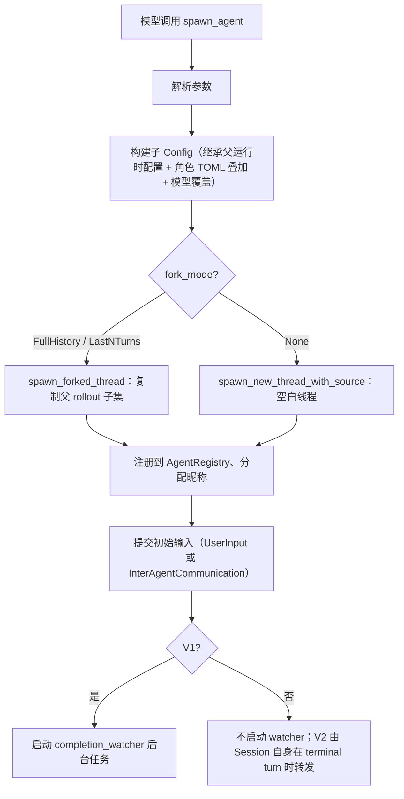

<section className="originalQuestionBox" aria-label="原始问题">
  <div className="originalQuestionLabel">原始问题</div>
  <blockquote>
    codex 有哪些 subagent？这些 subagent 是如何工作的？它们如何被触发？它们是怎么写的，目录结构怎样，怎么被设定，核心代码或者设定在哪？subagent 得到的东西如何进入主对话 context？当这些注入内容无用以后是否有清理机制？
  </blockquote>
</section>

## 先回答

Codex 的 subagent 不是"预定义的固定角色列表"，而是一套**线程化的 agent 运行时 + 角色配置层 + 工具协议**。主 agent 通过调用 `spawn_agent` 工具创建子线程，子线程拥有独立的 Session、独立的模型循环、独立的上下文窗口。

当前源码里有三个活跃的内建角色（awaiter 已注释掉），两套工具协议（V1 和 V2），以及两条不同的结果回注路径（V1 用 completion watcher，V2 用 Session 自身的 terminal turn 转发）。清理机制包括显式 close、V2 LRU 驱逐、注册表释放和数量上限。

## 内建角色

| 角色 | 状态 | config_file | 模型锁定 | 核心行为 |
|------|------|-------------|----------|----------|
| `default` | 活跃 | 无 | 否 | 继承父 agent 的运行时配置（模型、provider、审批策略等），不继承对话历史 |
| `explorer` | 活跃 | `explorer.toml`（空） | 否 | 快速、权威；用于代码库具体问题；鼓励并行 spawn 多个；复用已有 explorer |
| `worker` | 活跃 | 无 | 否 | 执行和生产工作；必须明确文件归属；必须告知 worker 不是唯一改代码的人 |
| `awaiter` | **已停用** | `awaiter.toml` | `reasoning_effort = "low"` | 只等待不修改；指数退避轮询；当前被注释掉不参与 spawn |

### 角色的本质：写给父 agent 看的使用说明

角色定义在 `codex-rs/core/src/agent/role.rs` 的 `built_in::configs()` 中。关键事实：**角色的 description 不会注入子 agent 的 prompt**。它被 `spawn_tool_spec::build()` 消费，生成父 agent 看到的 `spawn_agent` 工具描述文本：

```rust
// codex-rs/core/src/agent/role.rs — spawn_tool_spec 模块
pub(crate) fn build(user_defined_agent_roles: &BTreeMap<String, AgentRoleConfig>) -> String {
    let built_in_roles = built_in::configs();
    build_from_configs(built_in_roles, user_defined_agent_roles)
}
// 输出格式："Available roles:\nexplorer: { ... }\nworker: { ... }"
```

这段文本最终出现在父 agent 的 tool spec 里（`spec_plan.rs:399` 调用），告诉父 agent "你有哪些角色可以选、什么时候该用哪个"。子 agent 本身不知道自己是什么角色——它收到的只是一条 spawn 时的 message 参数。

角色对子 agent 的唯一实质影响是 `config_file` 指定的 TOML 层叠加。如果 TOML 里设了 `model` 或 `model_reasoning_effort`，这些值会锁定。当前 explorer.toml 是空文件，worker 没有 config_file，所以两者在运行时和 default 完全一样——同样的工具集、同样的模型、同样的权限。

### 配置继承 ≠ 历史继承

spawn 时子 agent 继承的是**运行时配置**（模型、provider、审批策略、cwd、沙箱设置），不是对话历史。历史是否继承由 `fork_context`（V1）或 `fork_turns`（V2）决定：

- 不 fork：子 agent 从空白线程开始，只收到 spawn message。
- `fork_turns = "all"`（V2）/ `fork_context = true`（V1）：复制父 rollout 的子集（保留 user/developer/assistant-final-answer 消息，丢弃工具调用和中间推理）。
- `fork_turns = "N"`（V2）：只复制最近 N 个 turn。

## 目录结构

```text
codex-rs/core/src/
├── agent/
│   ├── mod.rs                  # 模块导出
│   ├── role.rs                 # 角色解析、配置叠加、spawn tool spec 生成
│   ├── registry.rs             # AgentRegistry：V1 并发上限、昵称池、路径树
│   ├── control.rs              # AgentControl：spawn/message/close/status 的控制面
│   ├── control/
│   │   ├── spawn.rs            # spawn 实现（新建、fork、resume）
│   │   ├── legacy.rs           # close_agent、shutdown_agent_tree
│   │   ├── residency.rs        # V2 LRU 驱逐（独立于 AgentRegistry）
│   │   └── execution.rs        # 执行容量限制器
│   ├── agent_resolver.rs       # agent 路径引用解析
│   ├── agent_names.txt         # 昵称池（101 个科学家/哲学家名字）
│   ├── status.rs               # 状态判断辅助
│   └── builtins/
│       ├── explorer.toml       # explorer 角色配置（空文件）
│       └── awaiter.toml        # awaiter 角色配置（已停用）
├── tools/handlers/
│   ├── multi_agents/           # V1 工具处理器
│   │   ├── spawn.rs            # spawn_agent（含深度上限检查）
│   │   ├── send_input.rs       # send_input（向存活 thread 发消息）
│   │   ├── wait.rs             # wait_agent（等待终态）
│   │   ├── close_agent.rs      # close_agent
│   │   └── resume_agent.rs     # resume_agent（恢复已卸载/关闭的 thread）
│   ├── multi_agents_v2/        # V2 工具处理器
│   │   ├── spawn.rs            # spawn_agent（带 task_name，无显式深度检查）
│   │   ├── send_message.rs     # send_message（入队不触发 turn）
│   │   ├── followup_task.rs    # followup_task（入队并触发 turn）
│   │   ├── wait.rs             # wait_agent（基于 mailbox activity）
│   │   ├── list_agents.rs      # list_agents
│   │   └── interrupt_agent.rs  # interrupt_agent
│   └── multi_agents_common.rs  # 共享：config 构建、模型校验、参数解析
├── context/
│   ├── subagent_notification.rs        # V1 完成通知格式
│   └── inter_agent_completion_message.rs  # V2 完成消息格式
├── context_manager/
│   └── history.rs              # WorldState baseline/diff 记录
└── session_prefix.rs           # 通知/完成消息的格式化入口
```

## 触发机制

subagent 由主 agent 的模型输出触发——模型在 tool call 中调用 `spawn_agent`。这不是硬编码的 if-else 分支，而是模型根据 tool spec 里的角色描述自主决定何时 delegation。

### V1 协议

工具名带命名空间前缀（`multi_agent_v1::spawn_agent`），参数：

```rust
// codex-rs/core/src/tools/handlers/multi_agents/spawn.rs
struct SpawnAgentArgs {
    message: Option<String>,
    items: Option<Vec<UserInput>>,
    agent_type: Option<String>,       // 角色名
    model: Option<String>,            // 可覆盖子 agent 模型
    reasoning_effort: Option<ReasoningEffort>,
    service_tier: Option<String>,
    fork_context: bool,               // 是否 fork 父上下文
}
```

V1 handler 有显式深度上限检查：

```rust
let child_depth = next_thread_spawn_depth(&session_source);
let max_depth = turn.config.agent_max_depth;
if exceeds_thread_spawn_depth_limit(child_depth, max_depth) {
    return Err(FunctionCallError::RespondToModel(
        "Agent depth limit reached. Solve the task yourself.".to_string(),
    ));
}
```

spawn 后返回 `agent_id`（ThreadId），主 agent 后续用 `send_input`、`wait_agent`、`close_agent` 操作这个 ID。`send_input` 可以向任何存活的 thread 发送消息（包括已完成的），`resume_agent` 专门处理已卸载或关闭的 thread。

### V2 协议

工具名无命名空间（直接 `spawn_agent`），参数增加 `task_name`，去掉 `fork_context` 改为 `fork_turns`：

```rust
// codex-rs/core/src/tools/handlers/multi_agents_v2/spawn.rs
struct SpawnAgentArgs {
    message: String,
    task_name: String,                // 子 agent 的路径名（如 "fix-auth-bug"）
    agent_type: Option<String>,
    model: Option<String>,
    reasoning_effort: Option<ReasoningEffort>,
    service_tier: Option<String>,
    fork_turns: Option<String>,       // "none" | "all" | 正整数
}
```

V2 的核心区别：

- 子 agent 用 `AgentPath`（如 `root/fix-auth-bug`）标识而非裸 ThreadId。
- 通信走 `InterAgentCommunication` 结构；`send_message` 只入队不触发 turn，`followup_task` 入队并触发 turn。
- V2 spawn handler 没有显式深度上限检查（调用了 `next_thread_spawn_depth` 计算深度用于元数据，但不做 `exceeds_thread_spawn_depth_limit` 拦截）。
- V2 的容量管理走独立的 residency 机制，不受 AgentRegistry 总量计数约束。

### spawn 内部流程

无论 V1 还是 V2，最终都走 `AgentControl::spawn_agent_internal`：



## 结果如何进入主对话 context

V1 和 V2 走完全不同的回注路径。

### V1：completion watcher（后台任务被动注入）

`maybe_start_completion_watcher` 在 V1 spawn 时启动一个 tokio 后台任务，订阅子 agent 的状态 watch channel。当子 agent 到达终态，watcher 向父线程注入一条 user-role 消息：

```rust
// codex-rs/core/src/agent/control.rs
parent_thread
    .inject_user_message_without_turn(message)
    .await;
```

消息格式由 `SubagentNotification` 渲染，外层包裹 `<subagent_notification>` 标签：

```rust
// codex-rs/core/src/context/subagent_notification.rs
fn body(&self) -> String {
    format!(
        "\n{}\n",
        serde_json::json!({
            "agent_path": &self.agent_reference,
            "status": &self.status,
        })
    )
}
```

这条消息以 `role: "user"` 插入父对话历史，**不触发新 turn**（`inject_no_new_turn`），等模型下次被唤醒时自然读到。

### V2：Session 自身的 terminal turn 转发

V2 **不使用** completion watcher。回注由子 agent 的 Session 在 terminal turn 事件时主动触发：

```rust
// codex-rs/core/src/session/mod.rs:1801
async fn maybe_notify_parent_of_terminal_turn(&self, turn_context, msg) {
    // 仅 V2
    if turn_context.multi_agent_version != MultiAgentVersion::V2 { return; }
    // 仅终态事件
    if !matches!(msg, EventMsg::TurnComplete(_) | EventMsg::TurnAborted(_)) { return; }
    // 构造 InterAgentCommunication 发给父 agent
    self.forward_child_completion_to_parent(...).await;
}
```

完成消息格式由 `InterAgentCompletionMessage` 渲染：

```rust
// codex-rs/core/src/context/inter_agent_completion_message.rs
fn body(&self) -> String {
    format!(
        "Message Type: FINAL_ANSWER\nTask name: {}\nSender: {}\nPayload:\n{}",
        self.task_name, self.sender, self.payload,
    )
}
```

这条消息通过 `send_inter_agent_communication`（`trigger_turn = false`）投递到父 agent 的 mailbox，记录为 `AgentMessage`，后续 sampling 时读取。

**截断规则**：只有错误消息被截断（约 900 token），正常 Completed 消息的 payload 不截断：

```rust
// codex-rs/core/src/session_prefix.rs
AgentStatus::Completed(Some(message)) => message.clone(),  // 不截断
AgentStatus::Errored(error) => {
    let error = truncate_text(error, TruncationPolicy::Tokens(ERROR_MAX_TOKENS));
    // ERROR_MAX_TOKENS = 1000 - 100 = 900
    format!("Agent errored: {error}\n\n{ERROR_NEXT_ACTION}")
}
```

### 环境上下文：baseline/diff 记录

每个 model step 构建 world state 时，`format_environment_context_subagents` 列出当前存活的子 agent（`- agent_path: nickname` 格式）。但实际记录到模型上下文时采用 **baseline/diff 机制**（`context_manager/history.rs`）：首次全量写入，后续只记录变化部分，不是每步重复全量注入。

## 清理机制

### 显式关闭（V1 close_agent）

`close_agent` 工具调用 `shutdown_agent_tree`，递归关闭目标 agent 及其所有后代：

```rust
// codex-rs/core/src/agent/control/legacy.rs
pub(crate) async fn shutdown_agent_tree(&self, agent_id: ThreadId) -> CodexResult<String> {
    let descendant_ids = self.live_thread_spawn_descendants(agent_id).await?;
    let result = self.shutdown_live_agent(agent_id).await;
    for descendant_id in descendant_ids {
        match self.shutdown_live_agent(descendant_id).await {
            Ok(_) | Err(CodexErr::ThreadNotFound(_)) | Err(CodexErr::InternalAgentDied) => {}
            Err(err) => return Err(err),
        }
    }
    result
}
```

每个 `shutdown_live_agent`：flush rollout → 发送 Shutdown op → 从 ThreadManager 移除线程 → 从 AgentRegistry 释放计数。同时在持久化层把 spawn edge 标记为 Closed。

### V2 LRU 驱逐（独立于 AgentRegistry）

V2 有自己的容量管理——`V2Residency`，按 LRU 顺序驱逐已完成的 agent：

```rust
// codex-rs/core/src/agent/control/residency.rs
async fn is_unloadable(thread: &CodexThread) -> bool {
    matches!(
        thread.agent_status().await,
        AgentStatus::Completed(_) | AgentStatus::Errored(_) | AgentStatus::Interrupted
    ) && thread.session.active_turn.lock().await.is_none()
        && !thread.session.input_queue.has_pending_mailbox_items().await
}
```

V2 spawn 时绕过 AgentRegistry 的总量计数：

```rust
// codex-rs/core/src/agent/control/spawn.rs
let reservation_max_threads = if spawn_uses_v2_residency {
    None  // V2 不受 AgentRegistry 总量限制
} else {
    agent_max_threads
};
```

被驱逐的 agent 后续可以通过 `ensure_v2_agent_loaded` 从持久化存储重新加载。

### V1 注册表上限与深度限制

`AgentRegistry` 维护原子计数器，超过 `max_threads` 时 V1 spawn 返回 `AgentLimitReached`。深度上限由 V1 handler 的 `exceeds_thread_spawn_depth_limit` 检查执行。这两项限制不直接适用于 V2（V2 用 residency 管容量，无显式深度拦截）。

### 注入内容本身有没有"过期清理"？

没有单独的 TTL 或过期机制。注入到父对话历史里的通知消息，其生命周期分两层：

- **活跃上下文**：由父对话的 compaction 策略统一处理。触发上下文压缩时，这些消息和其他历史一起被摘要或截断。
- **持久化 rollout**：完整保留，不受 compaction 影响。

这是一个有意的取舍：不做精细的"通知过期"，依赖已有的 compaction 机制统一处理活跃窗口，持久化层保留完整记录。

## 架构张力

这套设计的核心张力在于：**子 agent 是完整线程，不是轻量协程**。

每个子 agent 拥有独立的 Session、独立的 model client、独立的 rollout 持久化、独立的上下文窗口。这意味着：

1. **隔离性强**：子 agent 的上下文膨胀不影响父 agent，父 agent 的 compaction 不会丢失子 agent 的工作记录。
2. **代价高**：每个子 agent 都是一个完整的模型会话，有独立的 token 消耗、独立的 API 调用。spawn 10 个 explorer 就是 10 个并行模型会话。
3. **回注是摘要式的**：父 agent 不会看到子 agent 的完整对话历史，只看到一条完成通知或 FINAL_ANSWER payload。这是有意为之——如果把子 agent 的完整历史灌进父上下文，delegation 就失去了上下文隔离的意义。

V1 和 V2 的并存反映了演进中的张力：

- V1 用裸 ThreadId 标识、用 `send_input` 直接投递用户消息、用 completion watcher 被动回注。
- V2 用 AgentPath 树状标识、用结构化的 `InterAgentCommunication` 协议、由 Session 自身在 terminal turn 主动转发、支持 mailbox 和 turn 触发分离。
- V2 的 `followup_task` 可以唤醒已完成的子 agent 继续工作；V1 的 `send_input` 也可以向存活 thread 发消息，但 `resume_agent` 才能恢复已卸载的 thread。

角色机制的张力在于：它约束的是调用者的 delegation 策略，而不是被调用者的行为。explorer 和 worker 在运行时没有任何能力差异，区别只在于父 agent 的 tool spec 里写了"什么时候该用哪个"。这让角色系统极其轻量（加一个角色只需要加一段 description），但也意味着角色无法强制执行行为边界——如果模型不遵守 description 里的规则，没有任何运行时机制能阻止。

---

源码快照：`openai/codex` @ `841e47b8fb`（`codex-rs/core/src/agent/`、`codex-rs/core/src/tools/handlers/multi_agents*/`、`codex-rs/core/src/session/mod.rs`、`codex-rs/core/src/context/`、`codex-rs/core/src/context_manager/history.rs`）
